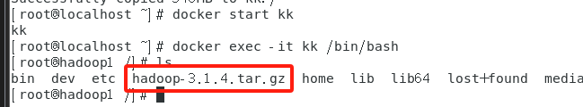
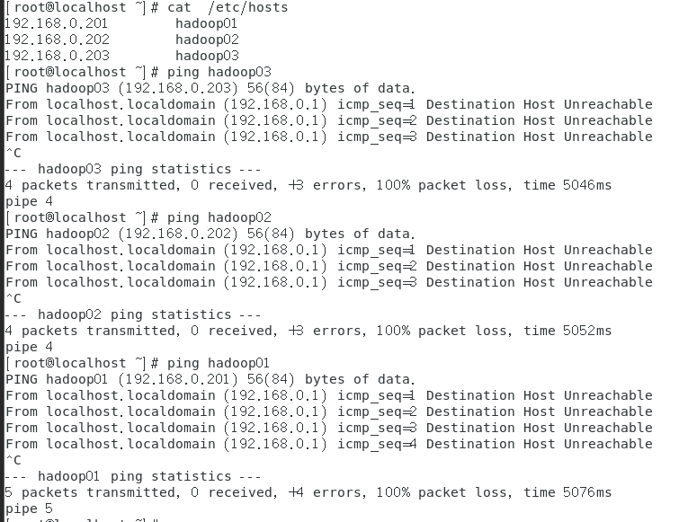

# Hadoop

## 文档遵循由上而下的顺序


# 下载软件和镜像

```
1.从 ftp://172.16.170.50/ ftp://172.16.193.251中的文件夹 VM已安装好的镜像中 下载 Centos_7.zip并解压到相关文件夹
2.打开VM （win10 用VM 15，win11 用 VM 16），找到解压后的VMX文件拖入软件。
账号和密码都为 root。

没有校园网就联系我，使用阿里云盘快传(新账号无法使用长期分享功能，后续跟新)
```

# 一.docker虚拟机使用方法

[docker虚拟机使用方法](https://docs.qq.com/doc/DZWhuYldPUXJORmRx)

```
#查看镜像  
docker images   
```


## #1. 下载docker仓库中的镜像

```
#格式：docker pull   镜像名    镜像名： 名称：标签
#注:本ISO的名称为: centos8  标签为:latest  且在VM运行后，可能会卡住，建议重开一个终端
docker pull   centos8:latest
```


## #2. 运行容器

```
#运行容器后不退出
#-i    让容器的标准输入保持打开
# -t   让Docker分配一个终端并绑定在容器的标准输入上
docker run -it centos8:latest /bin/bash
```


## #3. 查看容器

```
#查看所有容器，运行到此，就会这样：  docker ps #未启动的看不到 
docker ps -a 
```


## #4. 退出与重进

```
exit
#如果关闭了容器，则需要先打开，后进入
docker start ac311ff7d7fb 
docker exec -it ac311ff7d7fb  /bin/bash  
```


## #5. 停止、删除容器

```
#假设现在有好几个容器，需要删除，则需要先exit退出，stop停止后rm，然后根据 ID 删除。不建议使用"删除所有容器"
#格式：docker   rm   容器ID
exit
docker ps -a 
docker stop ac311ff7d7fb
docker rm ac311ff7d7fb 			#此刻就把刚刚用的容器删掉了，就需要回到 2. 直到 4.
```


## #6. 给容器改名 (以后启动就不需再输 ID)

```
#方法1   推荐使用方法2
#                 自定义      版本           地址
docker run -itd --name=kk centos8:latest /bin/bash
docker exec -it kk  /bin/bash
#改好名后，就可以直接用名字进入，和4.中进入一样道理
```


```
#但此刻,容器名仍是ID，所以可以用方法2 
#注意:运行方法1后，不能直接运行方法2,因为已经给刚刚的容器命名，需要删除后重建

#方法2  
docker run -itd  --name=kk  --hostname=hadoop1 centos8:latest /bin/bash
docker exec -it kk  /bin/bash
```


## #7. IP （这个没看懂，跳过）

```
#查看IP 
ip  address
#如果没有
yum  install  initscripts  -y
```


# 二.linux写文件的几种方法

[linux写文件的几种方法](https://docs.qq.com/doc/DZVJydFREWlhld3dD)

## #文本编辑

## #1.  vim  自动创建文件

```
#假设要在/opt中写一个1.txt的文件，里面写《静夜诗》  
cd /opt
vim 1.txt      #注:运行后，需要按任意键开始插入
《静夜诗》 

#退出的两种方式：
ESC键-->:wq  保存
ESC键-->:q!  不保存
```


## #2.  nano  

```
cd /opt
nano 2.txt 
《静夜诗》 
ctrl键+x-->y
```


## #3.  echo 重定向输出

```
#格式: echo  'ok'  > 文件名
#创建新文件 2.txt 并写入123
echo  '123'  >  2.txt

#在2.txt 最后追加写入  456
echo '789'  >>  2.txt

#4.cat   查看
cat 1.txt

#如果用 cat > 2.txt 重定向输入，则是覆盖型输入,输入完成后，enter-->ctrl+d
```


# 三.搭建单机模式Hadoop-----首次开工

[搭建单机模式Hadoop-----首次开工](https://docs.qq.com/doc/DZUFMV1J5WUdHbnhZ)

## #1. 进入容器

```
#因为导入的镜像中就已经自带Centos8 的镜像，所以无需下载
#首先进入先前已经改过名字的容器
docker exec -it kk /bin/bash
```


## #2. 修改软件安装源(在容器中)

```
#注：因需要访问 vault.centos.org 的 CentOS 历史存档源,所以 需要 联网
sed -i 's/mirrorlist/#mirrorlist/g' /etc/yum.repos.d/CentOS-*
sed -i 's|#baseurl=http://mirror.centos.org|baseurl=http://vault.centos.org|g' /etc/yum.repos.d/CentOS-*
yum makecache
```


## #3. 安装 OpenJDK 8 和 SSH 服务(在容器中)

```
#软件包都需要从 yum 源下载安装，需要 联网
yum install -y  java-1.8.0-openjdk-devel    openssh-clients     openssh-server
```


## #4. 启用 SSH 服务 

```
exit
systemctl enable sshd && systemctl start sshd

#退出，停止，然后保存为镜像(后续则无需再执行#3. #4. = 无需联网)
docker stop kk

#格式：docker commit   容器名    镜像名
docker commit kk java_ssh
```


## #5. Hadoop 安装

```
#创建 Hadoop 单机容器
docker run -d --name=hadoop_1 --privileged java_ssh /usr/sbin/init  
```


## #6. 下载 Hadoop

```
#校园网用户直接使用FTP
wget  ftp://172.16.170.50/hadoop-3.1.4.tar.gz
```


## #7. 非校园网用户下载方式 (CP法)

#其他用户从我的云盘下载压缩包到实体机，然后通过共享文件夹传入到虚拟机        (用校园网FTP的同学可直接跳转到 四.)

### ① 打开虚拟机的文件共享


### ② 在实体机中，方便寻找的位置创建一个文件夹


### ③ 设置为 共享文件夹


### ④ 回到VM 设置路径，名称自定义(不建议用中文)


### ⑤ 到终端进行路径挂载（重启后可能需要重新挂载）

```
#挂载
sudo mount -t fuse.vmhgfs-fuse .host:/ /mnt/hgfs/ -o allow_other
                                       #挂载点
#如果报错        
#  fuse: mountpoint is not empty
#  fuse: if you are sure this is safe, use the 'nonempty' mount option
sudo umount /mnt/hgfs/                                      

#访问挂载点有没有 hadoop-3.1.4.tar.gz 文件               tab键
ls /mnt/hgfs/Folder/
```


### ⑥ CP 主机的文件

```
#建议先CP到 Linux 中的 / 
ls /mnt/hgfs/Folder
cp /mnt/hgfs/Folder/hadoop-3.1.4.tar.gz /
ls /mnt/hgfs/Folder
```


```
#再 docker cp 到容器里
#格式： docker cp             <主机文件路径> <容器名>:<容器内路径>
docker cp /mnt/hgfs/Folder/hadoop-3.1.4.tar.gz kk:/
```


```
#进入容器开始解压，在此之前别忘了先打开
docker start kk
docker exec -it kk /bin/bash
ls 

#如果 ls 有 hadoop-3.1.4.tar.gz 文件，就成功了
```




### ⑦ 解压   (在容器中)

```
tar -zxvf hadoop-3.1.4.tar.gz
#移动到常用路径
mv    hadoop-3.1.4     /usr/local/hadoop     
#配置环境变量  这一段要一步一步来
echo 'export HADOOP_HOME=/usr/local/hadoop' >> /etc/bashrc 
echo 'export PATH=$PATH:$HADOOP_HOME/bin:$HADOOP_HOME/sbin' >> /etc/bashrc 

exit
docker exec -it kk /bin/bash

echo 'export JAVA_HOME=/usr' >> $HADOOP_HOME/etc/hadoop/hadoop-env.sh 
echo 'export HADOOP_HOME=/usr/local/hadoop' >> $HADOOP_HOME/etc/hadoop/hadoop-env.sh

#配置后，如果运行 后的内容如下，则正常 
hadoop
```


```
hadoop version
```


```
#运行 PI
hadoop jar /usr/local/hadoop/share/hadoop/mapreduce/hadoop-mapreduce-examples-3.1.4.jar pi 500 500        
```


# 四.搭建单机模式Hadoop-----认识环境变量

[搭建单机模式Hadoop-----认识环境变量](https://docs.qq.com/doc/DZUNIdVViWGNMSGZr)

## #1.安装 which工具

```
#在容器中，安装一个工具 which
yum install  which  -y

#查看容器位置
which  hadoop
#因为在 ⑦ mv hadoop-3.1.4 /usr/local/hadoop的时候已经移动到这了
```


## #2.习题4   写一段开机自启动的欢迎词

```
************************************
欢迎登录南充职业技术学院云计算机平台
************************************

#在容器中：
cd /etc/profile.d/
touch welcome.sh
vi welcome.sh 

#!/bin/bash
echo "************************************"
echo "Welcome to log in to the cloud computing platform of Nanchong Vocational and Technical College"
echo "************************************"

#ESC键 => :wq
exit
docker exec -it kk  /bin/bash 
#如果出现欢迎词则成功了
```


## #3. 文章总结

```
以下是TXYZ对整篇文档的总结
1. which 命令和 whereis 命令
   - `which` 命令用于查找可执行文件的位置,它会在 `PATH` 环境变量指定的目录中搜索。
   - `whereis` 命令用于查找文件的位置,它会在标准位置中搜索,包括 `PATH` 环境变量指定的目录。

2. 为什么 Hadoop 会安装在 /usr/local 目录下
   - `/usr/local` 目录通常用于存放本地安装的程序,这样可以与系统自带的软件包区分开来。
   - 将 Hadoop 安装在 `/usr/local/hadoop` 目录下是一个常见的做法,这样可以方便管理和维护。

3. 设置环境变量
   - 使用 `export` 命令可以设置环境变量,使其在当前 shell 会话中生效。
   - 为了让环境变量在系统启动时自动生效,可以将设置语句写入 `/etc/profile.d/` 目录下的 shell 脚本中。这样,每次登录系统时,这些脚本都会被执行,环境变量也会被设置。

4. PATH 环境变量
   - `PATH` 环境变量包含了一系列目录路径,用于告诉系统在哪里查找可执行文件。
   - 当你执行一个命令时,系统会按照 `PATH` 变量中的目录顺序进行搜索,直到找到该命令为止。
   - 可以使用 `export PATH=$PATH:/new/path` 的方式将新的目录添加到 `PATH` 变量中。


问题1: 我们在 /etc/profile.d/ 目录中放入了一个开机启动的文件 xxx.sh,能不能用 which 命令找到它的路径,为什么?

回答: 不能

· 在 `/etc/profile.d/` 目录中放置的 `xxx.sh` 文件,是在系统启动时自动执行的 shell 脚本。

· 这个脚本中可以设置各种环境变量,包括 `PATH` 变量。

· 由于 `/etc/profile.d/` 目录是系统默认的环境变量设置目录,因此 `which` 命令是无法直接找到这个脚本的位置的。`which` 命令只能查找 `PATH` 变量中包含的目录。
```


# 五.手动安装java、ssh

## #1. 重新创建一个名为 bbc 的容器

```
#为了方便区分，现在重新创建一个名为 bbc 的容器
docker run -d --name=bbc   --privileged   centos8     /usr/sbin/init
docker exec -it bbc /bin/bash

#先进入容器试试能不能yum makecache这个文件
#如果yum 不了文件，那就进行重写地址：
mkdir -p /etc/docker
tee /etc/docker/daemon.json <<'EOF'
{
"registry-mirrors": ["https://docker.m.daocloud.io","https://huecker.io","https://dockerhub.timeweb.cloud","https://noohub.ru"]
}
EOF

#enter键

exit
systemctl daemon-reload
service docker restart
```


## #2. 修改软件安装源

```
#此时所有的容器都被关掉了，要先打开刚刚创建的bbc容器
docker start bbc
docker exec -it bbc /bin/bash

#修改软件安装源
sed -i 's/mirrorlist/#mirrorlist/g' /etc/yum.repos.d/CentOS-*
sed -i 's|#baseurl=http://mirror.centos.org|baseurl=http://vault.centos.org|g' /etc/yum.repos.d/CentOS-*
yum makecache
```


## #3. 准备软件和安装环境

### ① CP法

```
#在容器中 创建用于存放软件包的目录
mkdir  /opt/packages       
mkdir  /opt/programs 

#退出容器挂载，详细见 五， 也可先挂载后进入容器创建目录再退出复制
exit
sudo mount -t fuse.vmhgfs-fuse .host:/ /mnt/hgfs/ -o allow_other

#复制到 根 和刚刚创建的容器中的路径
cp /mnt/hgfs/Folder/jdk-8u211-linux-x64.tar.gz /
docker cp //jdk-8u211-linux-x64.tar.gz bbc:/opt/packages     

# 进入容器解压
docker exec -it bbc  /bin/bash   
tar -zxvf  /opt/packages/jdk-8u211-linux-x64.tar.gz   -C  /opt/programs  
#  -C 指定解压路径


```


### ② 校园网法

```
#和6. 一样从 FTP 下载文件
#在容器中
wget   -P   /opt/packages/    ftp://172.16.170.50/jdk-8u211-linux-x64.tar.gz  
#  -P 指定保存路径
# 解压
tar -zxvf  /opt/packages/jdk-8u211-linux-x64.tar.gz   -C  /opt/programs  
#  -C 指定解压路径
```


## #4. 配置环境变量 (在容器中)

```
vi  /etc/profile.d/my_java.sh

export JAVA_HOME=/opt/programs/jdk1.8.0_211
export PATH=$PATH:$JAVA_HOME/bin

#ESC键 => :wq
exit
docker exec -it kk  /bin/bash   

#查看是否配置成功
export 
java   -version  
```


## #5. 安装 SSH 工具 

```
#openssh-server :服务端， openssh-clients :客户端
yum install -y   openssh-clients     openssh-server   

#启用 SSH 服务
systemctl enable sshd && systemctl start sshd

#设置密码为 bbc
echo  'root:bbc' | chpasswd
 
#为减小镜像体积，删除无用压缩包
#保存容器bbc为镜像bbc_java_ssh供以后使用。
rm  -rf  /opt/packages/jdk-8u211-linux-x64.tar.gz   #删除压缩包
exit          
docker stop bbc   
docker commit bbc bbc_java_ssh     
docker  images
```


# 六.安装 hadoop

[安装 hadoop——按教科书再做](https://docs.qq.com/doc/DZXdudUtOc29xVUxU)

```
习题6
制作镜像  java_ssh_hadoop
```

## #1. 创建容器

```
#使用前面创建好的镜像 java_ssh 来创建容器
docker run -d --name=ccd -h ccd --privileged java_ssh_had /usr/sbin/init   
mkdir /opt/programs  
mkdir /opt/packages

docker inspect ccd | grep "Image"
```

## #2. 下载安装  hadoop-2.7.6.tar.gz

### ①CP法 

```
#退出容器挂载，详细见 五， 也可先挂载后进入容器创建目录再退出复制
exit
sudo mount -t fuse.vmhgfs-fuse .host:/ /mnt/hgfs/ -o allow_other
                                       #挂载点
#如果报错        
#  fuse: mountpoint is not empty
#  fuse: if you are sure this is safe, use the 'nonempty' mount option
sudo umount /mnt/hgfs/                


#复制到 根 和刚刚创建的容器中的路径
cp /mnt/hgfs/Folder/hadoop-2.7.6.tar.gz /
docker cp //hadoop-2.7.6.tar.gz ccd:/opt/packages     

# 进入容器解压
docker exec -it ccd  /bin/bash   
tar -zxvf  /opt/packages/hadoop-2.7.6.tar.gz -C  /opt/programs  
#  -C 指定解压路径
```


### ②校园网法

```
#进入容器
docker exec -it ccd /bin/bash
wget    -P   /opt/packages/   ftp://172.16.170.50/hadoop-2.7.6.tar.gz
#如果不能 wget，就yum   如果 yum 半天，那就 重启
yum install wget
wget    -P   /opt/packages/   ftp://172.16.170.50/hadoop-2.7.6.tar.gz

# 解压安装包 解压到 /opt/programs  目录中
mkdir /opt/programs
tar -zxvf /opt/packages/hadoop-2.7.6.tar.gz -C /opt/programs
ls /opt/programs/hadoop-2.7.6/
```


## #3.  设置系统环境变量

```
touch /etc/profile.d/my_hadoop.sh 
cat > /etc/profile.d/my_hadoop.sh   << 'eof' 
export HADOOP_HOME=/opt/programs/hadoop-2.7.6
export PATH=$PATH:$HADOOP_HOME/bin:$HADOOP_HOME/sbin
eof

cat  /etc/profile.d/my_hadoop.sh
exit
docker exec -it ccd /bin/bash
echo   $HADOOP_HOME
```


## #4. 修改hadoop程序的文件hadoop-env.sh

```
#比较两次cat的最后几行，如果有 echo的两行，则正确
cat    $HADOOP_HOME/etc/hadoop/hadoop-env.sh 
echo "export JAVA_HOME=/opt/programs/jdk1.8.0_211" >> $HADOOP_HOME/etc/hadoop/hadoop-env.sh
echo "HADOOP_HOME=/opt/programs/hadoop-2.7.6" >> $HADOOP_HOME/etc/hadoop/hadoop-env.sh
cat    $HADOOP_HOME/etc/hadoop/hadoop-env.sh 
```


## #5. 运行测试

```
yum install  which  -y

#如果yum 不了文件，那就进行重写地址：
mkdir -p /etc/docker
tee /etc/docker/daemon.json <<'EOF'
{
"registry-mirrors": ["https://docker.m.daocloud.io","https://huecker.io","https://dockerhub.timeweb.cloud","https://noohub.ru"]
}
EOF

#还错就重启

hadoop version

#删除多余压缩文件，封装成镜像
rm /opt/packages/hadoop-2.7.6.tar.gz
exit
docker stop  bbc
docker commit bbc java_ssh_hadoop
docker images

#可能报错，但不影响：
/opt/programs/hadoop-2.7.6/bin/hadoop: line 166: /opt/programs/jdk1.8.0_211/bin/java: No such file or directory
```


#  七.Linux默认搜索路径相关知识

[Linux默认搜索路径相关知识](https://docs.qq.com/doc/DZVlHWG1KeUJsUXJF)

```
习题7
编写能够执行的程序test.sh  并将目录加入到搜索路径当中
```

## #1. bash 脚本程序

```
#假设有一个打印字符串的脚本 1.bash

echo   ‘hello world’     #打印字符hello world
```


## #2. 查看可以运行脚本的路径

```
echo $PATH
```


#只有在这个路径下的 .sh 文件才可以运行


## #3. 创建一个 .sh 脚本

```
cd /usr/local/bin

touch 1.sh

vi 1.sh

echo   ‘hello world’

#ESC键 => :wq
```


## #4. chmod 添加可执行属性

```
chmod  +x  1.sh

1.sh

#在其他路径运行就要用绝对地址
```


## #5. 配置环境，运行自定义路径下的脚本

```
cd /tmp/bash_1
touch 2.sh

vi 2.sh

echo   ‘heeelo world’
#ESC键 => :wq

chmod  +x  2.sh
export PATH=$PATH:/tmp/bash_1  #关机后就需要重新配置环境
/tmp/bash_1/2.sh
```


# 八. 快速构造镜像——化繁为简

[快速构造镜像——化繁为简，不做无用功](https://docs.qq.com/doc/DZVZndkx3YXhsREly)

```
习题8

制作镜像 java_ssh:v1
```

## #1. 创建一个空目录 ，并进去

```
mkdir  java_ssh     
cd  java_ssh
```


## #2. 创建一个指令文件，用于编写脚本

```
#可直接用vi
touch Dockerfile 
vi Dockerfile 


#此段为讲解，可直接跳转至 #3.

#在centos:latest镜像上操作，维护人是 kk
FROM centos:latest
MAINTAINER kk

#修改安装源
RUN sed -i 's/mirrorlist/#mirrorlist/g' /etc/yum.repos.d/CentOS-*
RUN sed -i 's|#baseurl=http://mirror.centos.org|baseurl=http://vault.centos.org|g' /etc/yum.repos.d/CentOS-*
RUN   yum makecache


#创建目录(若先前已有这个路径，就不用了)
RUN mkdir  /opt/packages  
RUN mkdir  /opt/programs 


#校园网用法
#安装软件工具wget
RUN yum install wget -y  
#下载安装包
RUN wget   -P   /opt/packages/    ftp://172.16.170.50/jdk-8u211-linux-x64.tar.gz 
#解压缩包
RUN tar -zxvf  /opt/packages/jdk-8u211-linux-x64.tar.gz  -C  /opt/programs 

#cp法
cp /mnt/hgfs/Folder/jdk-8u211-linux-x64.tar.gz  /  
tar -zxvf  /opt/packages/jdk-8u211-linux-x64.tar.gz  -C  /opt/programs  

#设置环境变量
RUN echo 'export JAVA_HOME=/opt/programs/jdk1.8.0_211' > /etc/profile.d/my_java.sh
RUN echo 'export PATH=$PATH:$JAVA_HOME/bin' >> /etc/profile.d/my_java.sh
#使设置的变更生效
RUN  source  /etc/profile.d/my_java.sh

#安装ssh 
RUN yum install -y   openssh-clients     openssh-server 

#启动ssh服务，不过有错，跳过
#RUN systemctl enable sshd && systemctl start sshd

#设置用户密码
RUN echo 'root:666' | chpasswd 
#删除无用的安装包
RUN rm  -rf  /opt/packages/jdk-8u211-linux-x64.tar.gz

#开放7号端口，ssh服务使用7号端口，根据需要你可以开放更多的端口
EXPOSE 22
#启动ssh服务 并且设置为开机启动
CMD ["/usr/sbin/sshd", "-D"]


#导出成功后可用命令  ls  查看到保存的压缩包
#导入镜像文件
docker load < java_ssh_bak.tar
格式为：
docker load <  保存的压缩包名字
#导入成功后可用命令  docker   images  查看到镜像名
如果你希望把 java_ssh_bak.tar存放在U盘上，需要sz命令把它传到机房windows 电脑上，再复制到U盘

```

## #3.代码行  下载安装jdk-8u211-linux-x64.tar.gz 

```
习题8
制作镜像 java_ssh:v1
```

### #①校园网法  习题8

```
mkdir  java_ssh     
cd  java_ssh

vi Dockerfile 

FROM centos8:latest
MAINTAINER kk

RUN sed -i 's/mirrorlist/#mirrorlist/g' /etc/yum.repos.d/CentOS-*
RUN sed -i 's|#baseurl=http://mirror.centos.org|baseurl=http://vault.centos.org|g' /etc/yum.repos.d/CentOS-*
RUN   yum makecache

RUN mkdir  /opt/packages  
RUN mkdir  /opt/programs 

RUN yum install wget -y  
RUN wget   -P   /opt/packages/    ftp://172.16.170.50/jdk-8u211-linux-x64.tar.gz 
RUN tar -zxvf  /opt/packages/jdk-8u211-linux-x64.tar.gz  -C  /opt/programs 

RUN echo 'export JAVA_HOME=/opt/programs/jdk1.8.0_211' > /etc/profile.d/my_java.sh
RUN echo 'export PATH=$PATH:$JAVA_HOME/bin' >> /etc/profile.d/my_java.sh
RUN  source  /etc/profile.d/my_java.sh
RUN yum install -y   openssh-clients     openssh-server 

RUN echo 'root:666' | chpasswd 
RUN rm  -rf  /opt/packages/jdk-8u211-linux-x64.tar.gz
EXPOSE 22
CMD ["/usr/sbin/sshd", "-D"]

ESC键==>:wq

docker build -t="java_ssh_self:v1"  .
docker save > java_ssh_self:v1.tar    java_ssh_self:v1
docker load < java_ssh_self:v1.tar
```


### #②CP法  习题8

```
mkdir  java_ssh     
cd  java_ssh
sudo mount -t fuse.vmhgfs-fuse .host:/ /mnt/hgfs/ -o allow_other

cp /mnt/hgfs/Folder/jdk-8u211-linux-x64.tar.gz /
mkdir  /opt/packages  
mkdir  /opt/programs 
tar -zxvf  //jdk-8u211-linux-x64.tar.gz  -C  /opt/programs 

vi Dockerfile 

FROM centos8:latest
MAINTAINER kk

RUN sed -i 's/mirrorlist/#mirrorlist/g' /etc/yum.repos.d/CentOS-*
RUN sed -i 's|#baseurl=http://mirror.centos.org|baseurl=http://vault.centos.org|g' /etc/yum.repos.d/CentOS-*
RUN   yum makecache

RUN echo 'export JAVA_HOME=/opt/programs/jdk1.8.0_211' > /etc/profile.d/my_java.sh
RUN echo 'export PATH=$PATH:$JAVA_HOME/bin' >> /etc/profile.d/my_java.sh
RUN  source  /etc/profile.d/my_java.sh

RUN yum install -y   openssh-clients     openssh-server 
RUN echo 'export JAVA_HOME=/opt/programs/jdk1.8.0_211' > /etc/profile.d/my_java.sh
RUN echo 'export PATH=$PATH:$JAVA_HOME/bin' >> /etc/profile.d/my_java.sh

RUN  source  /etc/profile.d/my_java.sh

RUN yum install -y   openssh-clients     openssh-server 
RUN echo 'root:666' >> /etc/passwd
RUN rm  -rf  /opt/packages/jdk-8u211-linux-x64.tar.gz
EXPOSE 22
CMD ["/usr/sbin/sshd", "-D"]

ESC键 ==> :wq

docker build -t="java_ssh_self:v1"  .
docker save > java_ssh_self:v1.tar    java_ssh_self:v1
docker load < java_ssh_self:v1.tar
```


```
习题9
制作镜像hadoop:v1
```

### #①校园网法  习题9

```
mkdir  hadoop    
cd  hadoop
vi Dockerfile

RUN mkdir  /opt/packages  
RUN mkdir  /opt/programs 

RUN yum install wget -y  
RUN wget -O   /opt/packages/hadoop-2.7.6.tar.gz   ftp://172.16.170.50/hadoop-2.7.6.tar.gz  


FROM   java_ssh_self:v1 
RUN  wget    -O   /opt/packages/hadoop-2.7.6.tar.gz     ftp://172.16.170.50/hadoop-2.7.6.tar.gz  
RUN  tar -zxvf /opt/packages/hadoop-2.7.6.tar.gz -C /opt/programs
RUN  echo 'export HADOOP_HOME=/opt/programs/hadoop-2.7.6'>/etc/profile.d/my_hadoop.sh \
&& echo 'export PATH=$PATH:$HADOOP_HOME/bin:$HADOOP_HOME/sbin'>>/etc/profile.d/my_hadoop.sh \
&&  source  /etc/profile.d/my_hadoop.sh \
&& echo 'export JAVA_HOME=/opt/programs/jdk1.8.0_211'>> $HADOOP_HOME/etc/hadoop/hadoop-env.sh \
&& echo 'export HADOOP_HOME=/opt/programs/hadoop-2.7.6'>>$HADOOP_HOME/etc/hadoop/hadoop-env.sh
RUN  yum install  which  -y  &&  rm  -rf  /opt/packages/hadoop-2.7.6.tar.gz

```

### #②CP法 习题9

```
mkdir  hadoop    
cd  hadoop

sudo mount -t fuse.vmhgfs-fuse .host:/ /mnt/hgfs/ -o allow_other

cp /mnt/hgfs/Folderhadoop-2.7.6.tar.gz /
mkdir  /opt/packages  
mkdir  /opt/programs 
tar -zxvf  //hadoop-2.7.6.tar.gz  -C  /opt/programs 

vi Dockerfile 

FROM  java_ssh_self:v1 
MAINTAINER kk

RUN sed -i 's/mirrorlist/#mirrorlist/g' /etc/yum.repos.d/CentOS-*
RUN sed -i 's|#baseurl=http://mirror.centos.org|baseurl=http://vault.centos.org|g' /etc/yum.repos.d/CentOS-*
RUN   yum makecache

RUN  echo 'export HADOOP_HOME=/opt/programs/hadoop-2.7.6'>/etc/profile.d/my_hadoop.sh \
&& echo 'export PATH=$PATH:$HADOOP_HOME/bin:$HADOOP_HOME/sbin'>>/etc/profile.d/my_hadoop.sh \
&&  source  /etc/profile.d/my_hadoop.sh \
&& echo 'export JAVA_HOME=/opt/programs/jdk1.8.0_211'>> $HADOOP_HOME/etc/hadoop/hadoop-env.sh \
&& echo 'export HADOOP_HOME=/opt/programs/hadoop-2.7.6'>>$HADOOP_HOME/etc/hadoop/hadoop-env.sh

ESC键 ==> :wq

docker build -t="java_ssh_self:v1"  .
docker save > java_ssh_self:v1.tar    java_ssh_self:v1
docker load < java_ssh_self:v1.tar


```


# 九. 安装zookeeper

[安装 zookeeper——给hadoop请一个帮手](https://docs.qq.com/doc/DZVl4QUFkRklxa2Nw)

```
习题10
制作包含zookeeper 的镜像  hadoop:v2
```

## #1. 创建容器，使用八. 安装的hadoop镜像  java_ssh_self:v1

```
docker run -d --name=aa -h aa --privileged java_ssh_self:v1 /usr/sbin/init
docker exec -it aa  /bin/bash
mkdir -p /opt/packages /opt/programs

#若需改名：
#格式：
docker  image  tag   原名字     新名字
docker  image  tag   java_ssh_self:v1     hadoop:v1
```

## #2. 下载安装 zookeeper-3.4.12.tar.gz  

## #①校园网法 习题10

```
wget    -P   /opt/packages/     ftp://172.16.170.50/zookeeper-3.4.12.tar.gz     
#顺便安装 hadoop-2.7.6 十. 用；jdk-8u211-linux-x64 十二. 用
wget    -P   /opt/packages/     ftp://172.16.170.50/hadoop-2.7.6.tar.gz     
wget   -P   /opt/packages/    ftp://172.16.170.50/jdk-8u211-linux-x64.tar.gz  

tar -zxvf /opt/packages/zookeeper-3.4.12.tar.gz -C /opt/programs
tar -zxvf /opt/packages/hadoop-2.7.6.tar.gz -C /opt/programs
tar -zxvf  /opt/packages/jdk-8u211-linux-x64.tar.gz   -C  /opt/programs  


   

# 进入容器解压
docker exec -it bbc  /bin/bash   

```

## #②CP法 习题10

```
#\挂载
exit
sudo mount -t fuse.vmhgfs-fuse .host:/ /mnt/hgfs/ -o allow_other

cp /mnt/hgfs/Folder/zookeeper-3.4.12.tar.gz /
cp /mnt/hgfs/Folder/hadoop-2.7.6.tar.gz /
cp /mnt/hgfs/Folder/jdk-8u211-linux-x64.tar.gz /
docker cp /zookeeper-3.4.12.tar.gz aa:/opt/packages
docker cp /hadoop-2.7.6.tar.gz aa:/opt/packages
docker cp //jdk-8u211-linux-x64.tar.gz bbc:/opt/packages  

docker exec -it aa  /bin/bash
tar -zxvf  /opt/packages/zookeeper-3.4.12.tar.gz  -C  /opt/programs 
tar -zxvf /opt/packages/hadoop-2.7.6.tar.gz -C /opt/programs
tar -zxvf  /opt/packages/jdk-8u211-linux-x64.tar.gz   -C  /opt/programs  
```


## #3. 改环境变量

```
echo 'export ZOOKEEPER_HOME=/opt/programs/zookeeper-3.4.12' > /etc/profile.d/my_zookeeper.sh 
echo 'export PATH=$PATH:$ZOOKEEPER_HOME/bin' >> /etc/profile.d/my_zookeeper.sh 

source  /etc/profile.d/my_zookeeper.sh

#如果在path中有zookeeper，则环境设置成功
export
```


## #4. 创建data日志和logs数据文件夹

```
mkdir  $ZOOKEEPER_HOME/data    $ZOOKEEPER_HOME/logs

#在data目录中建立一个myid 文件
echo '1'  > $ZOOKEEPER_HOME/data/myid

#配置文件zoo.cfg，依照ZOOKEEPER_HOME/conf 中的样板文件 zoo_sample.cfg
cp  $ZOOKEEPER_HOME/conf/zoo_sample.cfg    $ZOOKEEPER_HOME/conf/zoo.cfg  

#用sed命令，将 dataDir=/tmp/zookeeper 替换成 dataDir=/opt/programs/zookeeper-3.4.12/data
cat   $ZOOKEEPER_HOME/conf/zoo.cfg  
x='dataDir=/tmp/zookeeper'
y='dataDir=/opt/programs/zookeeper-3.4.12/data'
sed  -i "s|$x|$y|"  $ZOOKEEPER_HOME/conf/zoo.cfg

echo 'dataLogDir=/opt/programs/zookeeper-3.4.12/logs' >>$ZOOKEEPER_HOME/conf/zoo.cfg
echo 'server.1=hadoop01:2888:3888' >> $ZOOKEEPER_HOME/conf/zoo.cfg
echo 'server.2=hadoop02:2888:3888'>> $ZOOKEEPER_HOME/conf/zoo.cfg
echo 'server.3=hadoop03:2888:3888' >> $ZOOKEEPER_HOME/conf/zoo.cfg


rm  -rf  /opt/packages/zookeeper-3.4.12.tar.gz
rm  -rf  /opt/packages/hadoop-2.7.6.tar.gz
rm  -rf  /opt/packages/jdk-8u211-linux-x64.tar.gz
yum install  vim

#验证 
zkServer.sh start
```


## #5. 封装镜像 hadoop:v2

```
exit
docker commit aa  hadoop:v2
```


# 十. 修改hadoop配置文件——离成功更近一步

[修改hadoop配置文件——离成功更近一步](https://docs.qq.com/doc/DZVp0WWpSSW1zeXBq)

```
习题11
制作镜像  hadoop:v3
```

## #1. 创建容器(用镜像 hadoop:v2)

```
docker run -d --name=file10 --privileged -p 22  hadoop:v2 /usr/sbin/init  
docker ps -a
#端口映射信息，内部端口22映射到主机32768端口
```


## #2. 修改配置文件

[配置文件](https://docs.qq.com/doc/DZVRYYk14Q29ySHBH)

### #① 修改配置文件core-site.xml

```
docker exec -it file10  /bin/bash
cd /opt/programs/hadoop-2.7.6/etc/hadoop/ 
find / -name core-site.xml

vim core-site.xml  

<configuration>
<!--当多个HDFS集群工作时，指定集群的名称，但集群的名称不可重复-->
<property>
<name>fs.defaultFS</name>
<value>hdfs://ns</value>
</property>
<!--用于NameNode、DataNode、JournalNode等存放数据的公共目录，也可以分开指定-->
<property>
<name>hadoop.tmp.dir</name>
<value>/opt/programs/hadoop-2.7.6/tmp</value>
</property>
<!--指定ZooKeeper集群的地址和端口-->
<property>
<name>ha.zookeeper.quorum</name>
<value>hadoop01:2181,hadoop02:2181,hadoop03:2181</value>
</property>
</configuration>
```


### #②. 修改配置文件hdfs-site.xml

```
rm -rf hdfs-site.xml
vim hdfs-site.xml

<configuration>
<!--指定DataNode存储block的副本数-->
<property>
<name>dfs.replication</name>
<value>3</value>
</property>
<!-- HDFS集群的别称，需要和core-site.xml中保持一致-->
<property>
<name>dfs.nameservices</name>
<value>ns</value>
</property> 
<!--指定ns集群下的NameNode机器-->
<property>
<name>dfs.ha.namenodes.ns</name>
<value>nn1,nn2</value>
</property>
<!-- nn1 的 RPC 地址-->
<property> 
<name>dfs.namenode.rpc-address.ns.nn1</name>
<value>hadoop01:9000</value> 
</property>
<!--nn1 的 HTTP 地址-->
<property>
<name>dfs.namenode.http-address.ns.nn1</name>
<value>hadoop01:50070</value> 
</property>
<!-- nn2 的 RPC 地址-->
<property> 
<name>dfs.namenode.rpc-address.ns.nn2</name>
<value>hadoop02:9000</value> 
</property>
<!-- nn2 的 HTTP 地址-->
<property>
<name>dfs.namenode.http-address.ns.nn2</name>
<value>hadoop02:50070</value>
</property>
<!--指定nnl和nn2的元数椐在JoumalNode上的存储位置-->
<property>
<name>dfs.namenode.shared.edits.dir</name>
<value>qjournal://hadoop01:8485;hadoop02:8485;hadoop03:8485/ns</value>
</property>
<!--指定JournalNode的本地磁盘存储位置-->
<property>
<name>dfs.journalnode.edits.dir</name>
<value>/opt/programs/hadoop-2.7.6/journal/data</value>
</property>
<!--配置ns集群的NameNode失败时实现自动切换-->
<property>
<name>dfs.ha.automatic-failover.enabled</name>
<value>true</value>
</property>
<!--配置 client 的 failover 代理-->
<property> 
<name>dfs.client.failover.proxy.provider.ns</name>
<value>org.apache.hadoop.hdfs.server.namenode.ha.ConfiguredFailoverProxyProvider</value>
</property>
<!--配置隔离机制，已使用SSH方式进行NameNode的切换-->
<property>
<name>dfs.ha.fencing.methods</name>
<value>
sshfence
shell(/bin/true)
</value>
</property>
<!--当故障切换时，SSH免密码登录-->
<property>
<name>dfs.ha.fencing.ssh.private-key-files</name>
<value>/root/.ssh/id_rsa</value>
</property>
<!-- connect-timeout 链接超时-->
<property>
<name>dfs.ha.fencing.ssh.connect-timeout</name>
<value>30000</value>
</property>
</configuration>

```


### #③. 修改配置文件 mapred-site.xml

```
mv mapred-site.xml.template mapred-site.xml 
rm -rf mapred-site.xml
vim mapred-site.xml

<configuration>
<!--指定 MapReduce 在 YARN 上运行-->
<property>
<name>mapreduce.framework.name</name>
<value>yarn</value>
</property>
</configuration>

```


### #④. 修改配置文件yarn-site.xml

```
rm -rf yarn-site.xml
vim yarn-site.xml

<configuration>
<!--启动 HA-->
<property>
<name>yarn.resourcemanager.ha.enabled</name>
<value>true</value>
</property>
<!--标识集群-->
<property>
<name>yarn.resourcemanager.cluster-id</name>
<value>yrc</value>
</property>
<!--指定两个ResourceManager的名称-->
<property>
<name>yarn.resourcemanager.ha.rm-ids</name>
<value>rm1,rm2</value>
</property>
<!--指定rm1的地址-->
<property>
<name>yarn.resourcemanager.hostname.rm1</name>
<value>hadoop01</value>
</property>
<!--指定rm2的地址-->
<property>
<name>yarn.resourcemanager.hostname.rm2</name>
<value>hadoop02</value>
</property>
<!--指定 ZooKeeper 集群-->
<property>
<name>yarn.resourcemanager.zk-address</name>
<value>hadoop01:2181,hadoop02:2181,hadoop03:2181</value> 
</property>
<!--启动NodeManger时，server的加载方式-->
<property>
<name>yarn.nodemanager.aux-services</name>
<value>mapreduce_shuffle</value>
</property>
</configuration>

```


### #⑤. 修改配置文件slaves

```
echo  'hadoop01'  > /opt/programs/hadoop-2.7.6/etc/hadoop/slaves
echo  'hadoop02'  >> /opt/programs/hadoop-2.7.6/etc/hadoop/slaves
echo  'hadoop03' >> /opt/programs/hadoop-2.7.6/etc/hadoop/slaves
```


### #⑥. 修改配置文件 mapred-env.sh 和 yarn-env.sh

```
x="# export JAVA_HOME=.*"
y="export JAVA_HOME=/opt/programs/jdk1.8.0_211"
sed -i "s|$x|$y|"   /opt/programs/hadoop-2.7.6/etc/hadoop/mapred-env.sh
sed -i "s|$x|$y|"   /opt/programs/hadoop-2.7.6/etc/hadoop/yarn-env.sh
```


## #3. 封装为镜像 hadoop:v3

```
exit
docker stop  file10
docker  commit  file10  hadoop:v3
```


# 十一. 规划网络

[规划网络——准备联网](https://docs.qq.com/doc/DZWF0SFJkT2JualBo)

```
习题12
制作镜像 hadoop:v4,  并创建三个容器hadoop01、hadoop02、hadoop03，用命令测试是否能连通
 ping hadoop01
 ping hadoop02
 ping hadoop03
```

## #1. 创建自定义网络类型，并且指定网段

```
#清理未用的 Docker 网络      \                        指定了新网络的子网范围     名称
docker network prune -f && \docker network create --subnet=192.168.0.0/24 newnet 
```


## #2. 封装为镜像 hadoop:v4

```
echo '192.168.0.201        hadoop01' > ~/hosts
echo '192.168.0.202        hadoop02' >> ~/hosts
echo '192.168.0.203        hadoop03' >> ~/hosts
echo 'cat  ~/hosts  > /etc/hosts' >   /etc/profile.d/dns.sh

vim Dockerfile

FROM hadoop:v3
RUN  \
echo '192.168.0.201        hadoop01' > ~/hosts && \
echo '192.168.0.202        hadoop02' >> ~/hosts  && \
echo '192.168.0.203        hadoop03' >> ~/hosts  && \
echo 'cat  ~/hosts  > /etc/hosts' >    /etc/profile.d/dns.sh

docker build -t="hadoop:v4"   .
```


## #3. 创建三个容器，并且指定IP

```
docker run -itd  --name=hadoop01  -h hadoop01  --privileged \
--net newnet --ip 192.168.0.201 hadoop:v4  /usr/sbin/init

docker run -itd  --name=hadoop02  -h hadoop02  --privileged \
--net newnet --ip 192.168.0.202 hadoop:v4  /usr/sbin/init

docker run -itd  --name=hadoop03  -h hadoop03  --privileged \
--net newnet --ip 192.168.0.203 hadoop:v4  /usr/sbin/init


#如果能ping通就ok
ping 192.168.0.201

#在容器中查看IP
hostname  -I
```


## #4. 改ping名

```3
vim ~/hosts

192.168.0.201        hadoop01
192.168.0.202        hadoop02
192.168.0.203        hadoop03

vim  /etc/profile.d/dns.sh  
cat  ~/hosts  >  /etc/hosts    
source   /etc/profile.d/dns.sh  

#验证
cat  /etc/hosts

ping hadoop01
ping hadoop02
ping hadoop03
```




# 十二. ssh免密码登录

[设置ssh免密码登录——让通讯更畅通](https://docs.qq.com/doc/DZUdwSUVYTmVCelJO)

```
习题13 
用镜像hadoop:v4创建容器 hadoop01、hadoop02、hadoop03   设置它们之间免密码登录
```


## #1. 生成密钥对

```
#删除 ~/.ssh = 销毁秘钥
#id_rsa：私钥， id_rsa.pub：公钥
#查看
ls  -a  

ssh-keygen -t rsa -P "" -f ~/.ssh/id_rsa
```


## #2. 复制秘钥

```
#ssh-copy-id   -i    IP/名字/自己
					
#可能前边密码没有设置成功，重新设置一下

docker exec -it hadoop01 /bin/bash
echo  'root:123456' | chpasswd
exit

docker exec -it hadoop02 /bin/bash
echo  'root:123456' | chpasswd
exit

docker exec -it hadoop03 /bin/bash
echo  'root:123456' | chpasswd
exit

#yes  123456
ssh-copy-id -i hadoop01 && ssh-copy-id -i hadoop02 && ssh-copy-id -i hadoop03

```


## #3. 制作 hadoop:v5

```
mkdir ssh && cd ssh

cat >Dockerfile  <<eof
FROM hadoop:v4
RUN  \
rm -rf /root/.ssh && ssh-keygen -t rsa -P "" -f ~/.ssh/id_rsa && \
echo 'Host *' > /root/.ssh/config && \
echo '    StrictHostKeyChecking no' >> /root/.ssh/config && \
echo '    UserKnownHostsFile=/dev/null' >> /root/.ssh/config
eof

docker build -t="hadoop:v5"   .
```

# --------------------------------------------------------------------------------

# 以下部分笔记写的较为潦草，可能有报错（陪女朋友去了，没心思写）

# 十三. 启动高可用hadoop系统 （跳过）

[启动高可用hadoop系统——终于大功告成](https://docs.qq.com/doc/DZWpKZm9yZm1Vb0Nx)

```
习题14
安装并启动高可用hadoop系统
```

在完成 十二 的情况下运行

## #1. 启动zookeeper

```
#每个容器都启动
#修改myid值，用于标识


docker exec -it hadoop01 /bin/bash
zkServer.sh start     
exit                       

docker exec -it hadoop02 /bin/bash
echo '2' > /opt/programs/zookeeper-3.4.12/data/myid     
zkServer.sh start    
exit                           

docker exec -it hadoop03 /bin/bash
echo '3' > /opt/programs/zookeeper-3.4.12/data/myid    
zkServer.sh start      
exit 
```


## #2.启动 journalnode

```
docker exec -it hadoop01 /bin/bash
hadoop-daemon.sh start journalnode
exit

docker exec -it hadoop02 /bin/bash
hadoop-daemon.sh start journalnode
exit

docker exec -it hadoop03 /bin/bash
hadoop-daemon.sh start journalnode
exit
```


# 十四.快速搭建一个ubuntu系统  （这个可以仔细看看，认真写的）

[快速搭建一个ubuntu系统](https://docs.qq.com/doc/DZUdZREpJTFpEYnhF)

```
习题15
创建ubuntu虚拟机，并安装java、eclipse 
```

## #1.下载ubuntu系统

```
wget    ftp://172.16.193.251/ubuntu-desktop-lxde-vnc.tar       
docker load < ubuntu-desktop-lxde-vnc.tar         
```

## #2.查看导入是否成功

```
docker images                                                                         
```

## #3.运行容器，并登录ubuntu系统  

```
docker run -d \
--name ubuntu \
-p 6080:80 \
-p 5900:5900 \
-e VNC_PASSWORD=123@abc \
dorowu/ubuntu-desktop-lxde-vnc

#登录ubuntu系统  
#格式：http://云计算机IP:6080
172.16.125.240:6080
123@abc
```

## #4.安装java  （在Ubuntu中）

```
apt  update
apt list OpenJDK\*

apt install openjdk-21-jdk  -y

java -version
```


## #5.安装eclipse

```
wget ftp://172.16.193.251/eclipse-inst-linux64.tar.gz
tar -zxvf eclipse-inst-linux64.tar.gz
```

## #6.图形界面太过简单，和Windows操作一样，此不赘述


## #7.安装 thonny

```
apt install python3-pip -y
pip3 install thonny
apt install python3-tk -y

#登录
如果是2班 65号的同学，则网址为172.16.121.21:2265
172.16.121.21:2239
```


# 十五.安装伪分布式hadoop  （当时忘保存了，跳过）

[安装伪分布式hadoop——再次出发](https://docs.qq.com/doc/DZUNWaFRuTEliVFRa)

```
习题16
安装伪分布式的hadoop系统
```

## #1.下载指令代码

```
rm -rf /usr/sbin/fun && wget -P /usr/sbin/  ftp://172.16.193.251/sh/fun && echo '. fun'>/etc/profile.d/myfun.sh && . fun
```

## #2.创建一台机器nczy

```
pc  nczy   hadoop:v2                                               
go nczy 
cd   /opt/programs/hadoop-2.7.6/etc/hadoop          
```

## #3.1 快捷方法

```
mkdir nczy && cd nczy
cat >Dockerfile  <<eof
FROM  hadoop:v1
RUN  \
cd   /opt/programs/hadoop-2.7.6/etc/hadoop   &&  wget  -N  ftp://172.16.193.251/xml0/*  && \ 
yum install dos2unix  -y && dos2unix *  &&  echo  'hadoop0'  >  slaves  &&  x='export HADOOP_CONF_DIR=\$.*'    && \
y='export HADOOP_CONF_DIR=/opt/programs/hadoop-2.7.6/etc/hadoop'    && \
sed -i "s|\$x|\$y|"   hadoop-env.sh 
eof
docker build -t="hadoop:v0"  .  
```

## #3.2修改配置文件

### 修改配置文件core-site.xml

```
#将 “<configuration>” 和 “</configuration>” 标签的内容修改如下:
vim core-site.xml

<configuration>
<!--配置 NameNode -->
<property>
<name>fs.defaultFS</name>
<value>hdfs://hadoop0:9000</value>
</property>
<!--指定Hadoop数据的临时存放目录-->
<property>
<name>hadoop.tmp.dir</name>
<value>/opt/programs/hadoop-2.7.6/tmp</value>
</property>
</configuration>

:wq
```

### 修改配置文件hdfs-site.xml

```
#将 “<configuration>” 和 “</conflguration>” 标签的内容修改如下：
vim hdfs-site.xml

<configuration>
<!--伪分布式只有一台机器，配置副本数量为1-->
<property>
<name>dfs.replication</name>
<value>1 </value>
</property>
</configuration>

:wq
```

### 修改配置文件 mapred-site.xmlo

```
mv mapred-site.xml.template mapred-site.xml

#将“<configuration，”和“</configuration>”标签的内容修改如下：
vim mapred-site.xmlo

<configuration>
<!--配置MapReduce运行在YARN上-->
<property>
<name>mapreduce.framework.name</name>
<value>yarn</value>
</property>
<!--配置集群的权限验证-->
<property>
<name>dfs.permissions</name>
<value>false</value>
</property>
</configuration>

:wq
```

### 修改配置文件yam-site.xml    

```
#将 “<configuration>” 和 “</configuration>” 标签的内容修改如下： 
vim yam-site.xml    

<configuration>
<!--指定 ResourceManager -->
<property>
<name>yam.resourcemanager.hostname</name>
<value>hadoop0</value>
</property>
<!--启动NodeManger时，server的加载方式-->
<property>
<name>yarn.nodemanager.aux-services</name>
<value>mapreduce_shuffle</value>
</property>
</configuration>

:wq
```

### #修改配置文件slaves

```
echo  'hadoop0'  >  slaves
```

### #修改配置文件hadoop-env.sh

```
#将 “export HADOOP_CONF_DIR=$ {HADOOP_CONF_DIR:-7etc/hadoopn}" 一行改为:
vim hadoop-env.sh
export HADOOP_CONF_DIR=/opt/programs/hadoop-2.7.6/etc/hadoop

:wq

source hadoop-env.sh

x='export HADOOP_CONF_DIR=$.*'
y='export HADOOP_CONF_DIR=/opt/programs/hadoop-2.7.6/etc/hadoop'
sed -i "s|$x|$y|"   hadoop-env.sh 
source hadoop-env.sh
```

## #4.保存镜像

```
exit 
docker stop nczy
docker commit nczy hadoop:v0
```


-----------------------

# 到此为止吧，能考好多看各位实力了，我不想写了

## #5.启动hadoop系统

```
#报错就跳过这一句
docker network prune -f && \
docker network create --subnet=192.168.0.0/24 staticnet  

docker run -itd  --name=hadoop0  -h hadoop0  --privileged \
--net staticnet --ip 192.168.0.200 \
hadoop:v0  /usr/sbin/init

2. 设置免密码
go hadoop0     #进入机器中
rm -rf ~/.ssh/
ssh-keygen -t rsa -P "" -f ~/.ssh/id_rsa && ssh-copy-id -i hadoop0
3. 格式化HDFS
执行以下命令：
hdfs namenode -format

```


十六.


## #1. 安装java

```
java   -version
```

## #2.安装 maven

```
wget ftp://172.16.193.251/apache-maven-3.6.1-bin.tar.gz 
tar -zxvf apache-maven-3.6.1-bin.tar.gz -C /opt/  

vi   /etc/profile.d/my_maven.sh
export MAVEN_HOME=/opt/apache-maven-3.6.1export PATH=$PATH:$MAVEN_HOME/bin

source    /etc/profile.d/my_maven.sh
```

## #3.安装eclipse

```
wget ftp://172.16.193.251/eclipse-jee-luna-SR2-linux-gtk-x86_64.tar.gz   

tar -zxvf eclipse-jee-luna-SR2-linux-gtk-x86_64.tar.gz -C /opt/  

cd /opt/eclipse

ln -s /opt/eclipse/eclipse /usr/bin/eclipse
```

## #4.安装maven仓库

```
wget ftp://172.16.193.251/repository.tar.gz
mkdir ~/.m2/
tar -zxvf repository.tar.gz -C ~/.m2/
cp /opt/apache-maven-3.6.1/conf/settings.xml ~/.m2

```


