# Linux 第11章 Apache Web服务器的搭建及应用

http://172.16.198.15:9936/z11.html


# 1.Web简介

## 软件环境：

### 网页文件组成网站：html、asp、php、jsp

### 网页服务器软件：interet信息服务器(IIS)，Apache

### 操作系统：Windows、Linux


## 硬件环境：

### 服务器：CPU、内存、硬盘（通过网络访问）


# 2.Web访问服务器步骤

```
例：访问 http://172.16.198.15/1.html
1.浏览器输入网址 http://172.16.198.15/1.html
2.浏览器与IP为 172.16.198.15 的服务器的80端口连接
3.服务器上的Apache将网页文件1.html通过http协议发给用户浏览器
4.浏览器接受、解释文件内容
```

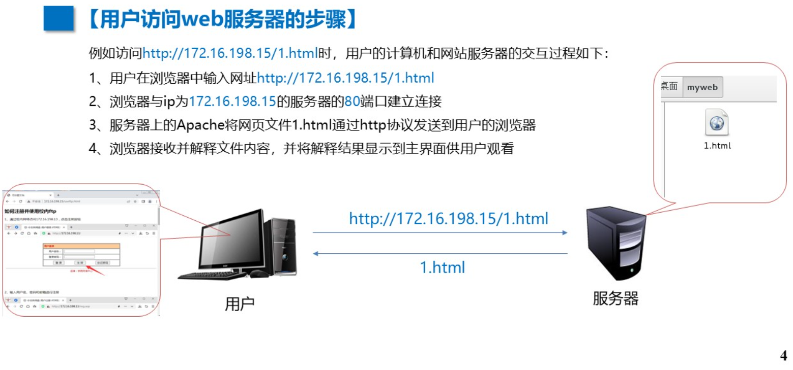


# Web服务器安装

## 1.配置自动安装环境yum

### ①挂载ISO到目录

```
#创建挂载目录
mkdir /mnt/cdrom

#挂载(重启重挂)
mount /dev/cdrom /mnt/cdrom

#df查看挂载详情
df
```

### ②指定yum安装源

```
#yum的配置文件存放在/etc/yum.repos.d/目录下，文件后缀名是repo  创建一备份目录backup，移动原配置文件到备份目录，再建立一新repo文件
cd /etc/yum.repos.d/
ls
mkdir backup
mv *.re* backup/
ls

#新建一配置文件
touch newyum.repo
vim newyum.repo

[thenewyum]
name=thenewyum
baseurl=file:///mnt/cdrom
enabled=1
gpgcheck=0

:wq

#解释
[thenewyum]
name=the new yum  # 软件源名
baseurl=file:///mnt/cdrom  # 原地址(设为本地光盘挂载路径)
enabled=1  # 启用 yum 源
gpgcheck=0  # 不检查 GPG-KEY
```

## ③更新yum软件源缓存

```
yum clean all
yum makecache
```

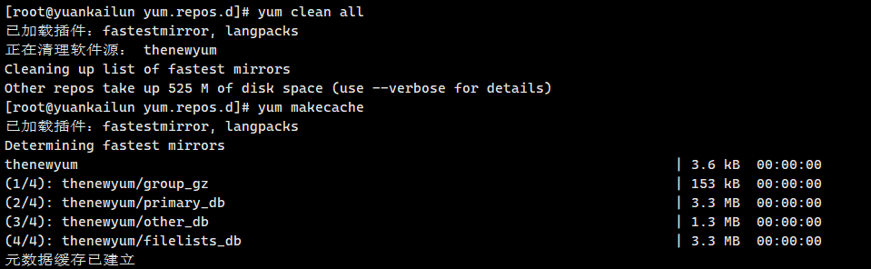

## 2.安装web服务器软件Apache

### ①安装Apache

```
yum install httpd
y
y
```

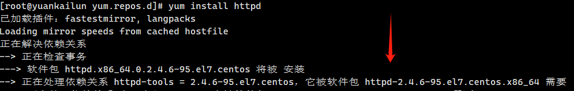


### ②启用Apache并开机自启

```
systemctl start httpd
systemctl enable httpd

#若不能访问，可能是防火墙
关闭防火墙:systemctl stop firewalld
禁用防火墙:systemctl disable firewalld

#测验
#在浏览器网址栏输入自己IP
172.16.128.139
```

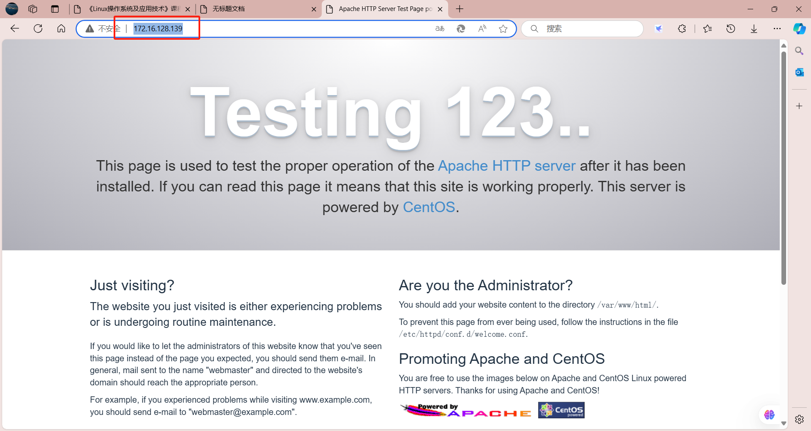


## 自定义网页

Apache默认网站目录(根目录):/var/www/html/    如没有网络文件，则显示测试网页

在 根目录 下新建网页文件 .html 重新访问即可

其他服务操作:

```
关闭服务:systemctl stop httpd
重启服务:systemctl restart httpd
重新加载配置:systemctl reload httpd
查看服务状态:systemctl status httpd
```

### 创建网页

```
#在/var/www/html/ 中
touch index.html

vim index.html

<!DOCTYPE html>
<html lang="zh-CN">
<head>
    <meta charset="UTF-8">
    <meta name="viewport" content="width=device-width, initial-scale=1.0">
    <title>我的第一个网页</title>
</head>
<body>
    <h1>这是我的第一个网页</h1>
</body>
</html>

:wq
```


# P17 随堂练

```
#1 (在web服务器安装已经做过)
mkdir /mnt/cdrom
mount /dev/cdrom /mnt/cdrom

cd /etc/yum.repos.d/
mkdir backup
mv *.re* backup/

touch newyum.repo
vim newyum.repo

[thenewyum]
name=thenewyum
baseurl=file:///mnt/cdrom
enabled=1
gpgcheck=0

:wq

yum clean all
yum makecache

yum install httpd
y
y

systemctl start httpd
systemctl enable httpd

systemctl stop firewalld
systemctl disable firewalld

#2
vim index.html

<!DOCTYPE html>
<html lang="zh-CN">
<head>
    <meta charset="UTF-8">
    <meta name="viewport" content="width=device-width, initial-scale=1.0">
    <title>阿帕奇网页</title>
</head>
<body>
    <h1>你好，这是我的第一个网页</h1>
	<h1>这是23人工2班 袁楷伦的网页 学号:39</h1>
    <p>欢迎来到袁楷伦的个人网页！</p>
</body>
</html>

这是袁楷伦的网页 39
:wq

#3
vim /var/www/html/index.html

<html>
<body>
    <h1>Welcome to my web</h1>
    <a href="/jgx/dianxinxi.html">电信系</a><br>
    <a href="/jgx/jingguanxi.html">经管系</a><br>
    <a href="http://172.16.128.113/" target="_blank">前往13号同学的网页</a><br>
    <a href="http://172.16.128.125/" target="_blank">前往25号同学的网页</a>
</body>
</html>

:wq

systemctl restart httpd
```

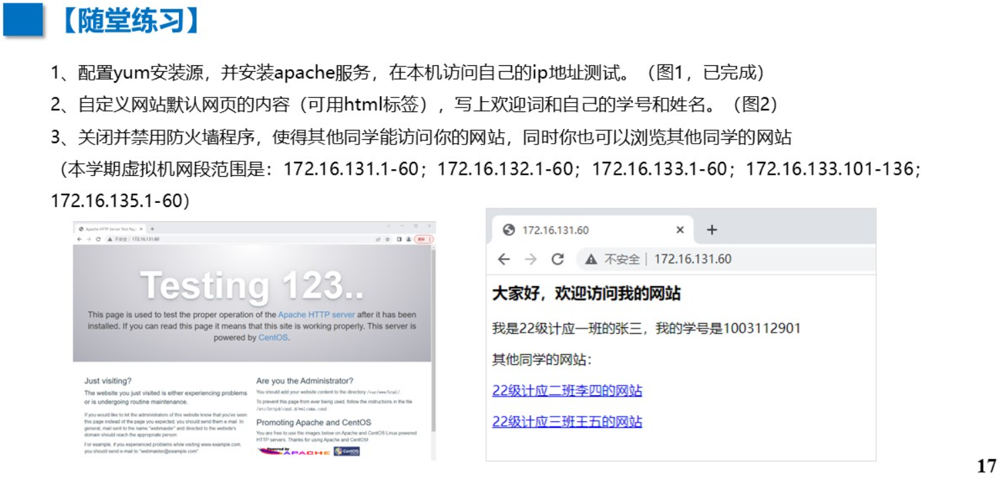

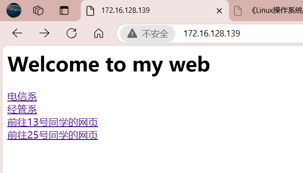


# 3.用虚拟目录创建子网站

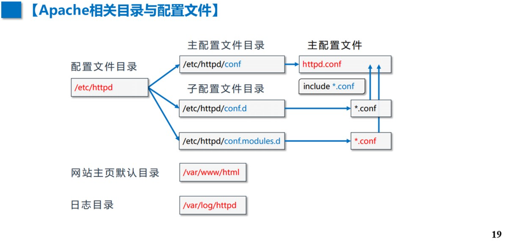


## 在/var 下创建子目录 = 创建子网页目录

```
#在/var 下创建子目录
cd /var
mkdir dianxinxi
cd /dianxinxi
touch dx.html

#编辑网页
vim dx.html

<!DOCTYPE html>
<html lang="zh-CN">
<head>
    <meta charset="UTF-8">
    <meta name="viewport" content="width=device-width, initial-scale=1.0">
    <title>阿帕奇网页</title>
</head>
<body>
    <h1>你好，这是我的第一个网页</h1>
	<h1>这是23人工2班 袁楷伦的网页 学号:39</h1>
    <p>欢迎来到袁楷伦的个人网页！</p>
</body>
</html>

:Wq

#到/etc/httpd/conf/ 编辑 httpd.conf

cd /etc/httpd/conf/ 
ls
vim httpd.conf

#手打
:/alias_module

#更改
<IfModule alias_module>
    ScriptAlias /cgi-bin/ "/var/www/cgi-bin/"

    Alias /dxx "/var/dianxinxi"
    <Directory "/var/dianxinxi">
        Require all granted
    </Directory>
</IfModule>

systemctl restart httpd
systemctl stop firewalld
setenforce 0

#浏览器访问(详见5.)
http://172.16.128.139//dxx/dx.html
```

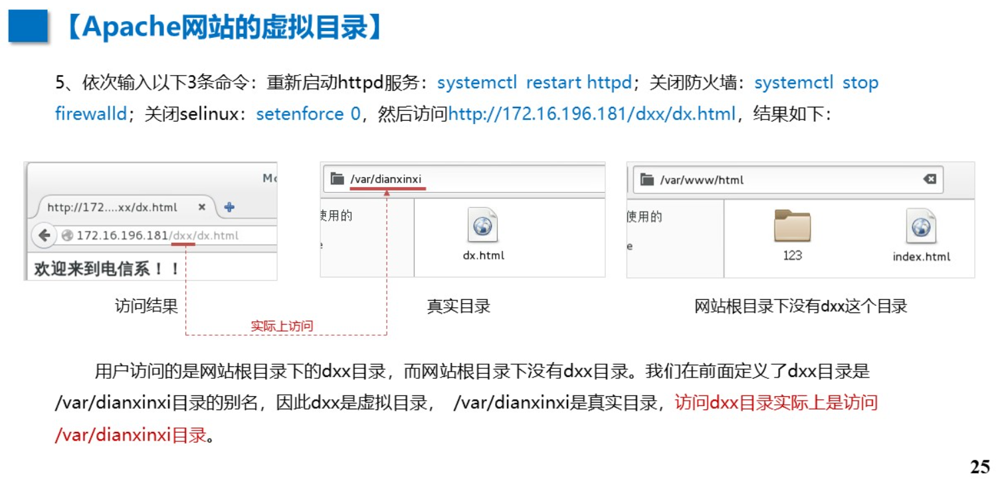


# P26 随堂练

```
#1
mkdir -p /var/www/html/web/tumuxi
echo "Welcome to the" > /var/www/html/web/tumuxi/index.html

#注意找到 Alias /dxx "/var/dianxinxi"
vim /etc/httpd/conf/httpd.conf

CustomLog "logs/access_log" combined

<IfModule alias_module>
    ScriptAlias /cgi-bin/ "/var/www/cgi-bin/"
    
    Alias /dxx "/var/dianxinxi"
    Alias /tmx "/var/www/html/web/tumuxi"
    
    <Directory "/var/www/html/web/tumuxi">
        Require all granted
    </Directory>

    <Directory "/var/dianxinxi">
        Require all granted
    </Directory>
</IfModule>


apachectl configtest

systemctl restart httpd

http://172.16.128.139/tmx/
```

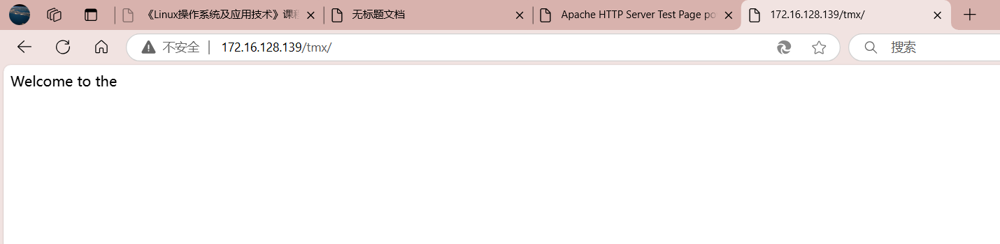

```
#2
mkdir -p /var/www/html/web/jingguanxi
echo "Welcome to my web" > /var/www/html/web/jingguanxi/index.html

echo '<html><body><h1>Welcome to my web</h1><a href="/jgx/dianxinxi.html">电信系</a><br><a href="/jgx/jingguanxi.html">经管系</a></body></html>' > /var/www/html/index.html

vim /etc/httpd/conf/httpd.conf


CustomLog "logs/access_log" combined

<IfModule alias_module>
    ScriptAlias /cgi-bin/ "/var/www/cgi-bin/"
    
    Alias /dxx "/var/dianxinxi"
    Alias /tmx "/var/www/html/web/tumuxi"
    Alias /jgx "/var/www/html/web/jingguanxi" 
    
    <Directory "/var/www/html/web/tumuxi">
        Require all granted
    </Directory>

    <Directory "/var/dianxinxi">
        Require all granted
    </Directory>

    <Directory "/var/www/html/web/jingguanxi">  
        Require all granted
    </Directory>
</IfModule>


echo '<html><body><h1>Welcome to the 电信系</h1></body></html>' > /var/www/html/web/jingguanxi/dianxinxi.html
echo '<html><body><h1>Welcome to the 经管系</h1></body></html>' > /var/www/html/web/jingguanxi/jingguanxi.html

apachectl configtest
systemctl restart httpd
```

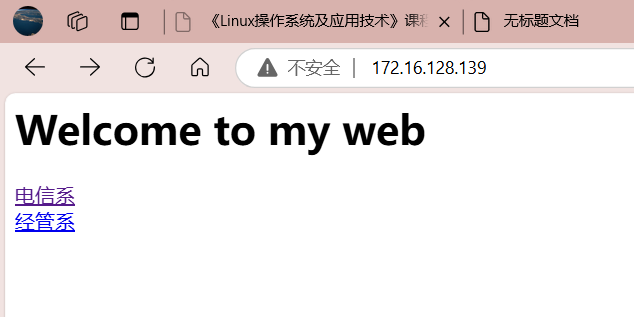

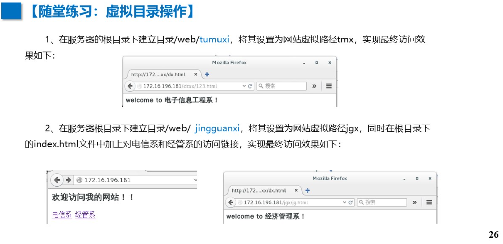


# 4.使用端口实现一机多站

## 用端口建立多个web站点

```
#在/var/www目录下创建另一个网站的根目录my81web，在该目录下创建名为abc.html的网页
mkdir /var/www/my81web
echo "欢迎访间81端口网站">/var/www/my81web/abc.html

#编辑配置文件/etc/httpd/conf/httpd.conf ,在Listen 80下面新增如下内容:

vim /etc/httpd/conf/httpd.conf

Listen 81
<VirtualHost 172.16.128.139:81>
DocumentRoot "/var/www/my81web"
</VirtualHost>

:wq

systemctl restart httpd

#访问
172.16.128.139:81/abc.html
```

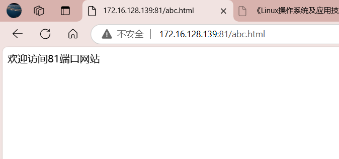


# P29 随堂练

```
#1
mkdir /var/www/my8088web
mkdir /var/www/my8080web

echo "欢迎访间8088端口网站">/var/www/my8088web/ABC.html
echo "欢迎访间8080端口网站">/var/www/my8080web/qwe.html

vim /etc/httpd/conf/httpd.conf

Listen 8088
<VirtualHost 172.16.128.139:8088>
DocumentRoot "/var/www/my8088web"
</VirtualHost>

Listen 8088
<VirtualHost 172.16.128.139:8080>
DocumentRoot "/var/www/my8080web"
</VirtualHost>

:Wq

systemctl restart httpd
#2

#3


```

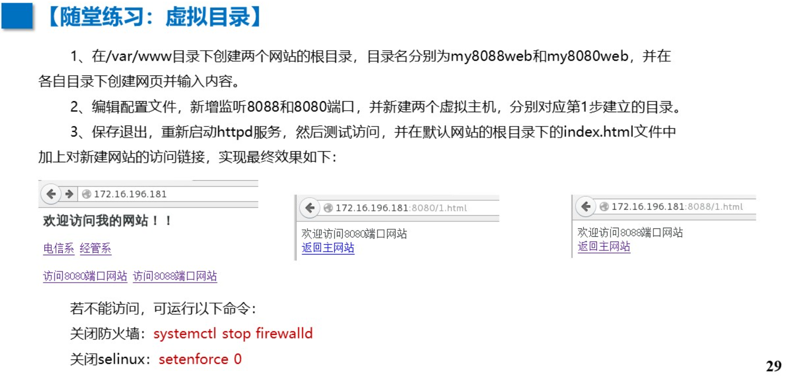


```
mkdir -p /var/www/html/jgx
echo '<html><body><h1>Welcome to the 电信系</h1></body></html>' > /var/www/html/jgx/dianxinxi.html
echo '<html><body><h1>Welcome to the 经管系</h1></body></html>' > /var/www/html/jgx/jingguanxi.html


echo '<html><body><h1>Welcome to my web</h1><a href="/jgx/dianxinxi.html">电信系</a><br><a href="/jgx/jingguanxi.html">经管系</a><br><a href="http://172.16.128.113/" target="_blank">前往13号同学的网页</a><br><a href="http://172.16.128.125/" target="_blank">前往25号同学的网页</a><br><br><br><br></body></html>' > /var/www/html/index.html
0
vim /etc/httpd/conf/httpd.conf


CustomLog "logs/access_log" combined

<html>
<body>
    <h1>Welcome to my web</h1>
    <a href="/jgx/dianxinxi.html">电信系</a><br>
    <a href="/jgx/jingguanxi.html">经管系</a><br>
    <a href="http://172.16.128.113/" target="_blank">前往13号同学的网页</a><br>
    <a href="http://172.16.128.125/" target="_blank">前往25号同学的网页</a><br><br>

    <!-- 添加图片 -->
    <br>
    <br>
    
</body>
</html>


echo '<html><body><h1>Welcome to the 电信系</h1></body></html>' > /var/www/html/web/jingguanxi/dianxinxi.html
echo '<html><body><h1>Welcome to the 经管系</h1></body></html>' > /var/www/html/web/jingguanxi/jingguanxi.html

apachectl configtest
systemctl restart httpd
```


