# 第三章

http://172.16.198.15:9936/z03.html

# 一. 登录/退出

```
#用户名输入后，passwd输入不会显示

#n分钟后 关机
shutdown -h n

#n分钟后 重启
shutdown -h n

#取消
shutdown -c
```


# 二.修改密码

```
passwd
```


# 三. 目录命令

## 1 pwd      显示

## 2 cd          进入

## 3 mkdir   创建

### 		mkdir -p 多级创建

## 4 rmdir    删除

### 		rmdir -p 递归删除


## # P27 练习

```
#1
cd /bin
#2
cd /usr/tmp
#3
cd /usr/local/games
#4
cd /home/alice/books
#5
cd /home/alice/books/文学
```

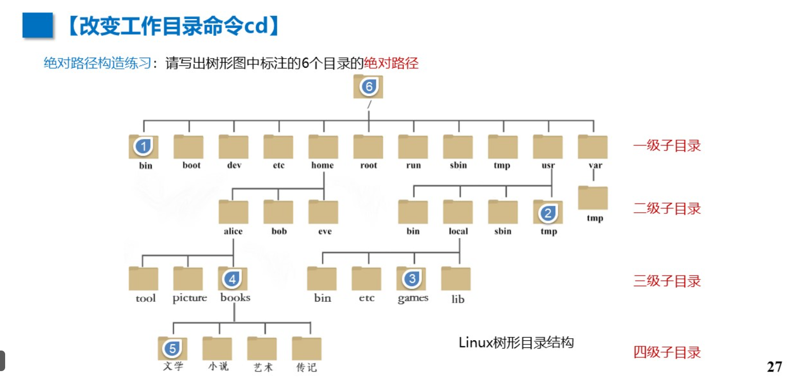


## #P30 练习

```
#5--2
cd ../../../../usr/tmp
#2--5
cd ../../home/alice/books/文学
#5--4
cd ..
#4--5
cd /文学
#3--1
cd ../../../../bin
#1--3
cd ../usr/local/games
```

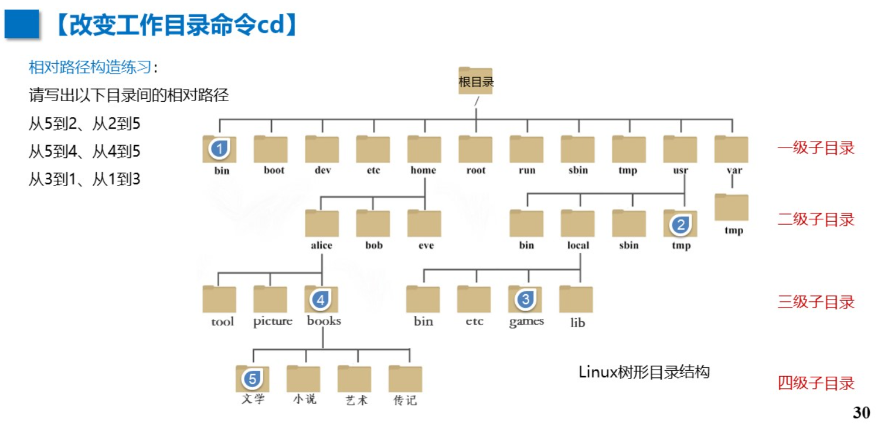


## #P35 随堂测

```
B    D
```

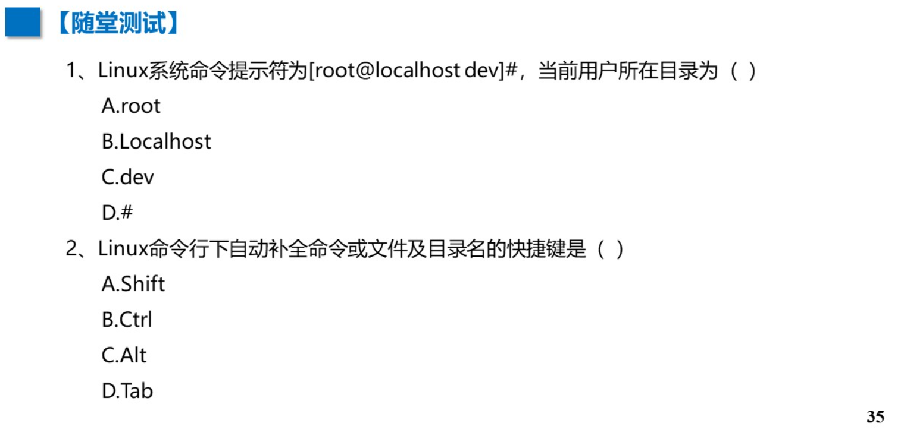


## #P39 练习

```
mkdir -p /home/alice/books/文学
mkdir -p /home/alice/books/小说
mkdir -p /home/alice/books/艺术
mkdir -p /home/alice/books/传记
mkdir -p /home/alice/tool
mkdir -p /home/alice/picutre
mkdir -p /home/bob
mkdir -p /home/eve
```

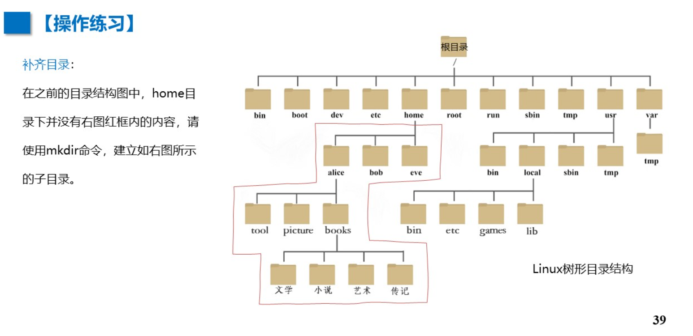


# 四. 文件命令

## 1 touch								   创建

## 2 ls 									  	显示

### 	① ls -a 所有

### 	② ls -l  清单

### 	③ ls -r 反序

### 	④ ls -t 时间正序

### 	⑤ ls -h 文件大小


## 3 cp 									 	复制

### 	① cp [操作] (源)(目标)

```
# 1.txt复制到  /home 改名2.txt
cp 1.txt /home/2.txt
```

### 	② cp -r /a /b 复制递归文件夹


## 4 rm										 删除

### 	① rm [操作] (目标)

### 	② rm -f	强制删除


## 5 mv										 移动

### 		mv (源) (目标)

```
# 3.txt移动到/home 改名4.txt
mv 3.txt /home/4.txt
```


## 6 ln 										  链接（快捷方式）

### 		ln [操作] (目标) (名字)

```
#创建软连接在/home 名为slinkdir
ln -s /home / slinkdir
```

## 7 cat     显示所有

```
#显示行号的显示所有
cat -n /etc/passwd
```

### ①	head    头部

```
#显示前15行(默认前10行)
head -15 /etc/passwd
```

### ②	tail		尾部

```
#显示后15行(默认后10行)
tail -15 /etc/passwd
```

### ③	more	分页显示

```
#只能enter下一页
more /etc/ssh/sshd_config
```

### ④	less   可翻页显示

```
#显示行号的显示，用↑↓翻页，q退出
less -N /etc/ssh/sshd_config
```


## 8 wc 										 统计

### ①	wc -l	行数

### ②	wc -c	字节数(大小)

### ③	wc -w	字数

```
wc -lcw /etc/passwd
```

## #P47 随堂测

```
C C
```

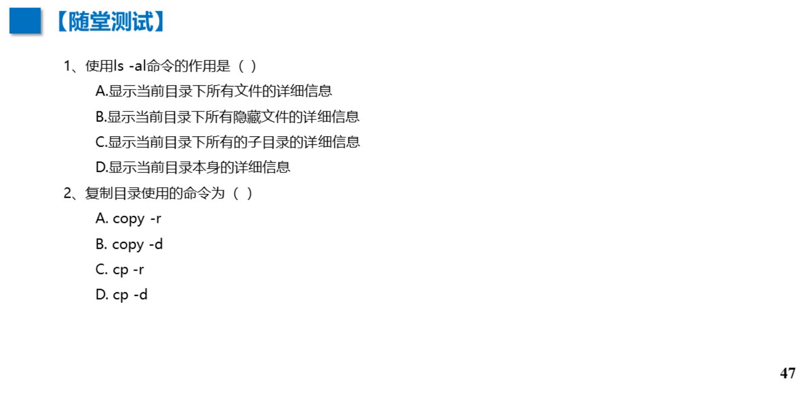

## #P53 随堂练

```
#1
mkdir /tmp/dir1
mkdir /tmp/dir2

#2
mkdir -p /tmp/dir1 
touch /tmp/dir1/file1 /tmp/dir1/file2 /tmp/dir1/file3

#3
mkdir -p /tmp/dir2/zml1
mkdir -p /tmp/dir2/zml2
mkdir -p /tmp/dir2/zml3

#4
cp /tmp/dir1/file1 /tmp/dir2/zml2/fileback1

#5
mv /tmp/dir1/file2 /tmp/dir2/zml1/fileback2

#6
cp -a /tmp/dir2 /tmp/dir1

#7
ln -s /tmp/dir1/file3 linktofile3

#8
rm -rf /tmp/dir1 /tmp/dir2
```

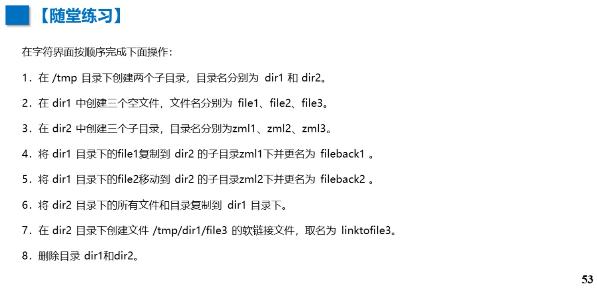


## #P60 随堂测

```
#1
mkdir /tmp/read

#2
cp /etc/ssh/sshd_config /tmp/read/testfile

#3
cat /tmp/read/testfile

#4
head -9 /tmp/read/testfile
#5
tail -7 /tmp/read/testfile
#6
more /tmp/read/testfile
#7
less /tmp/read/testfile
#8
rm -rf /tmp/read/testfile
#9
rmdir /tmp/read
```


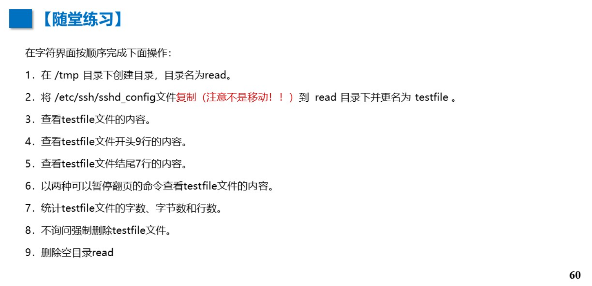


# 五. 通配符

## *	匹配0个/任意个字符

## ?	任意一个(有且仅一个)字符

```
ls -l	a*		以a开头
ls -l	*a		以a结尾		
ls -l	*a*		包含a的
ls -l	？a*		第 2 个字符为a
ls -l	？？a*    第 3 个字符为a
```


## #P64随堂测

```
#1
ls -a /bin ab*
#2
ls -a /bin *c
#3
ls -a /bin *bug*
#4
ls -a /bin ???????m*
#5
ls -l /bin ?????s????
#6
ls -l /bin ?a??b?*
```

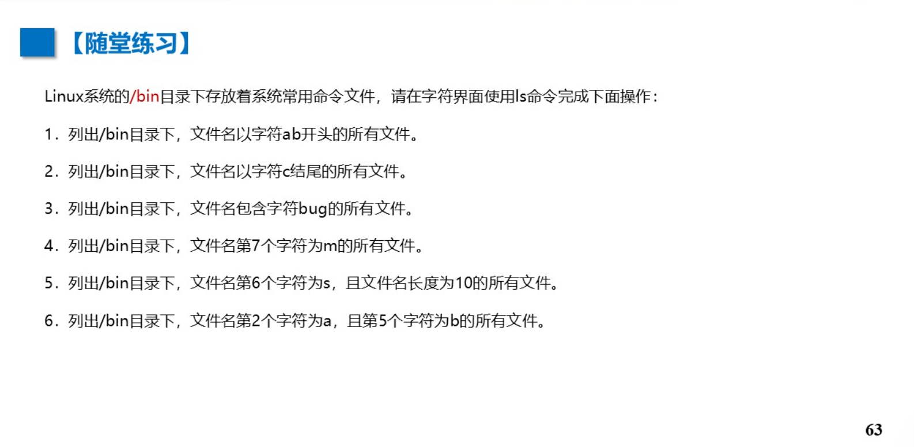


# 六. 文件压缩

## 1 gzip  压缩/解压  .gz

```
#压缩
gzip -r /tmp/read/testfile
#解压
gzip -d /tmp/read/testfile.gz
```

## 2 zip/unzip 压缩/解压 .zip

```
#格式：zip (压缩后名) (压缩文件名)
#压缩
zip test.zip 1.txt
#解压
unzip test.zip -d /tmp
```


## 3 tar  多文件打包压缩

### ①	tar -f  指定存档文件

### ②	tar -c  创建新归档文件

### ③	tar -z 用gzip操作

### ④	tar -C  指定还原目录

```
#打包
#把abc的目录中的所有文件打包到111.tzr
tar -cf 111.tar abc

#取消打包回 222
tar -xf 111.tar -C  222

#打包压缩abc的文件到111.tar.gz
tar -zcf 111.tar.gz abc

#解压222.tar.gz的文件，并还原到555中
tar -zxf 222.tar.gz  -C 555
```


## #P71 随堂测

```
#1
mkdir /tmp/ystest1 /tmp/ystest2
#2
cp /usr/share/hwdata/oui.txt /tmp/ystes1 ysfile.txt
#3
ls /tmp/ystes1/ysfile.txt
gzip -r /tmp/ystes1/ysfile.txt
ls /tmp/ystes1/ysfile.txt
#4
ls /tmp/ystes1/ysfile.txt
zip ysfile.txt ysfile.txt.zip
ls /tmp/ystes1/ysfile.txt
unzip ysfile.txt.zip 
ls /tmp/ystes1/ysfile.txt
#5
cp -r /boot /tmp/ystest1
#6
tar -zcf /tmp/ystest2/ystest1.tar.gz /tmp/ystest1
#7
tar -zxf /tmp/ystest2/ystest1.tar.gz -C /tmp/ystest2
#8
rm -rf /tmp/ystest1 /tmp/ystest2
```

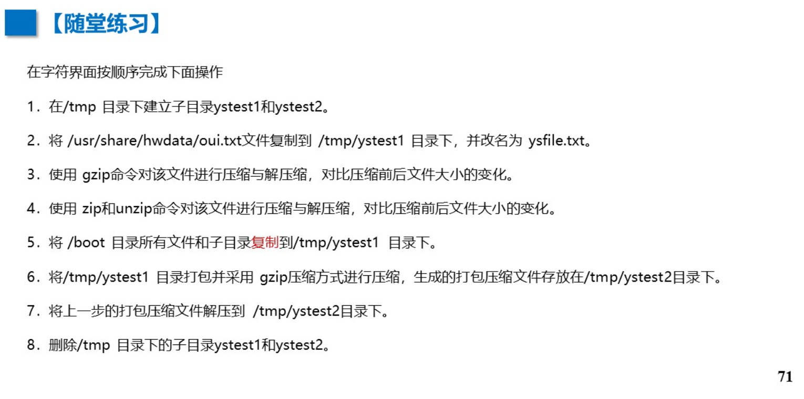

# 七. 查找

## 1 find

```
#格式
#find 搜索的目录 [操作]搜索的内容

#在/root中招名为aaa的文件
find /root/ -name "aaa"

#在当前目录查找(不加. 默认从当前目录开始)
find . -name "aaa"
```

### ① 大小    k M G

### 	 -size +1k

### 	 -size -2M

### ② 文件类型

### 	-type d：  目录 

### 	-type f：  普通文件

### 	-type l：  软连接 

```
find /etc -type d
```

### ③ 通配符

### 	find -name "*.png"

### 	find -name "le*"

### 	find -name "？？？？"

### ④ 逻辑运算

### 	-a	    与

### 	-o 	   或

### 	-not	非

```
find /bin/ -size +2k -a -type f
```


## P79 随堂测

```
#1
find /usr/share/pixmaps -name "*.png"
#2
find /usr/share/icnons -name "we*" -a "*.png"
#3
find /bin -name "s*" -a -size +100k
#4
find /etc -name "a*" -a -size +2k  -a -size -4k 
#5
find /etc -name "a*????" -o -name "b*??????"
#6
find /etc -name "a*" -o -name "b*"  -a -size -10k
```

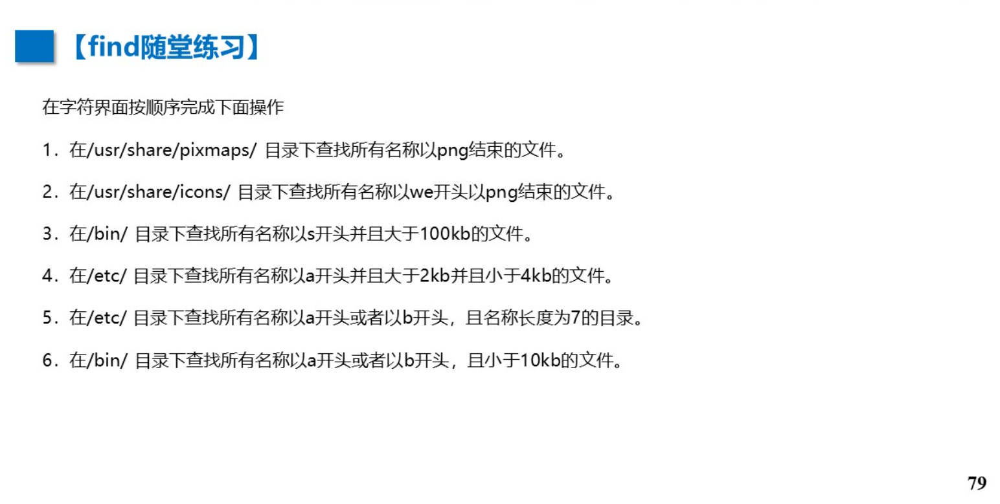


## 2 grep

```
#格式：
grep [操作][匹配模式][文件]

#常见用法
#/root下包含print的文件
grep -r "print" /root

#a2.txt中,含 d 的文件
grep "d"  a2 txt

#a2.txt中,"1“和"2"之间包含任意两个字符的字符
grep "1..2" a2.txt

#a2.txt中,第1个必须为0，第2个0有0次/多次的字符
grep "00*" a2.txt

#a2.txt中,第1个为a，第2个为b，第3个为b/c的字符
grep "ab[bc]' a2.txt

#a2.txt中,含f~q的字符
grep '[f-q]" a2.txt

#a2.txt中,含所有数字的字符
grep “[0-9]" a2.txt

#a2.txt中,以1开头的行
grep '^1" a2.txt
 
#在a2.txt中,以2结尾的行
grep"2$" a2.txt

#a2.txt中,不是以2结尾的行
grep -v "2$" a2.txt

#a2.txt中,前面是空格的a字符
grep '[[:space:]]a" a2.txt
```


## P85 随堂测

```
#1
grep -n "数学" a1.txt
#2
grep -n "女" a1.txt
#3
grep -n "一级教师$" a1.txt
#4
grep -n “[50-59]" a1.txt
#5
grep -nnot "市直"  a1.txt
#6
grep -n "电话号码" -a '^13" a1.txt
#7
grep -n "电话号码" -a '^135" -a '^136" -a '^137"a1.txt
#8
grep -n "电话号码" -a '[02468]$' a1.txt
```

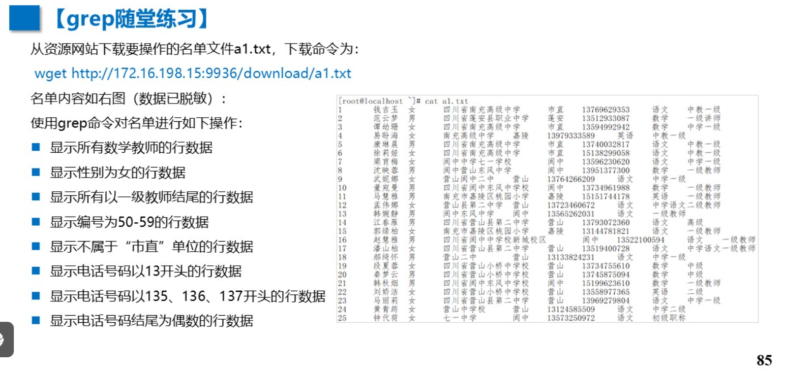


# 八. 管道符  |  链接

## P87 随堂练

```
#1
ls -l /etc | grep -v '^d' | wc -l

#2
ls -l /etc | grep '^d' | wc -l

#3
ls -l /etc | grep '^l' | wc -l

#4
cat a1.txt | grep "营山" | grep "男" | wc -l

#5
cat -n a1.txt | grep "营山" | grep "男" | awk '$1>=50 && $1<=65'
```

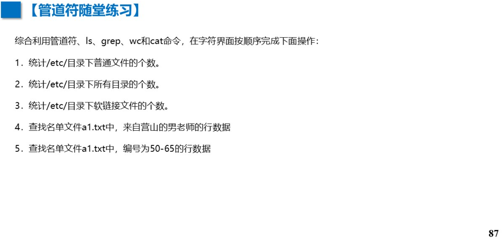


# 九. 其他

## 1 echo 输出重定向

### > 		覆盖

### >>	   追加

```
#把 hello world！覆盖到 文件 a 中
echo hello world！ > a

#把 hello world！追加到 文件 a 末尾
echo hello world！ >> a
```


## 2 date  日期

### %Y 年	%y 月	%d 日	%H 时	%M 分	%S 秒

```
date +%Y-%m-%d	#2024-10-31
date +%Y:%m:%d	#2024:10:31
```


## 3 cal  日历

### 	-y	全年日历

### 	-j	一年中第几天

```
#显示2018年12月日历，定位到当月15日
cal 15 12 2018 
```


## 4 alias 别名

```
#用于替换命令，用 mydir代替ls--color
alias mydir="ls--color"
```


## P99 随堂练

```
#1
echo hello world！
#2
echo hello world > t1
#3
echo this is my file >> t1
#4
clear
#5
echo date
#6
echo "$(date)" >> t1
#7
alias chakan="cat -n t1"
#8
cat t1 |rm -rf t1
```

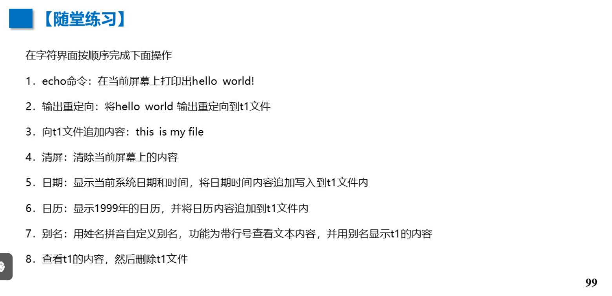


