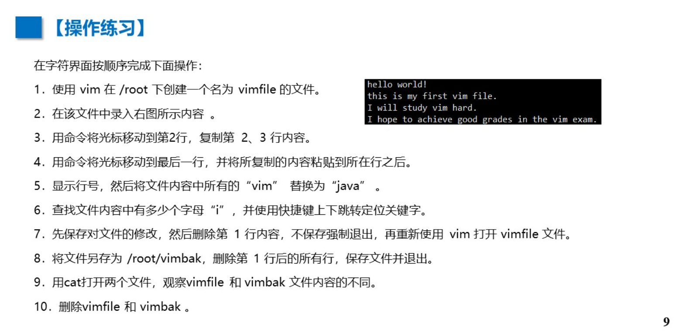

# vim

# ESC键 =>

## 	:q! 不保存退出

## 	:wq 保存退出

## 	:wq[路径] (文件名)  另存为退出

## 	/ word  查找

## 	:set nu  显示行号

## 	:set nonu  不显示行号

## 	: %s /word1 /word2  g 替换  g 全局

## 	复制/粘贴  (有问题)

​	yy 复制当前行

​	p 光标


# P9 随堂练

```
#1
vim /root/vimfile

#2
hello world!
this is my first vim file.
I will study vim hard.
I hope to achieve good grades in the vim exam.

#3
2yy

#4
p

#5
:set nu
:%s /vim /java g

#6
:%s/i//gn

#:%s 替换
/i/ 查找模式
// 不替换,只统计数量。
/gn 全局统计并显示匹配的数量。

#下一个	/i<Enter>
#上一个	?i<Enter>

#7
:wq
dd
:q!
vim /root/vimfile

#8
dG
:wq /root/vimbak

#9
cat vimbak 
cat vimfile

#10
rm -rf vimbak | vimfile
```


