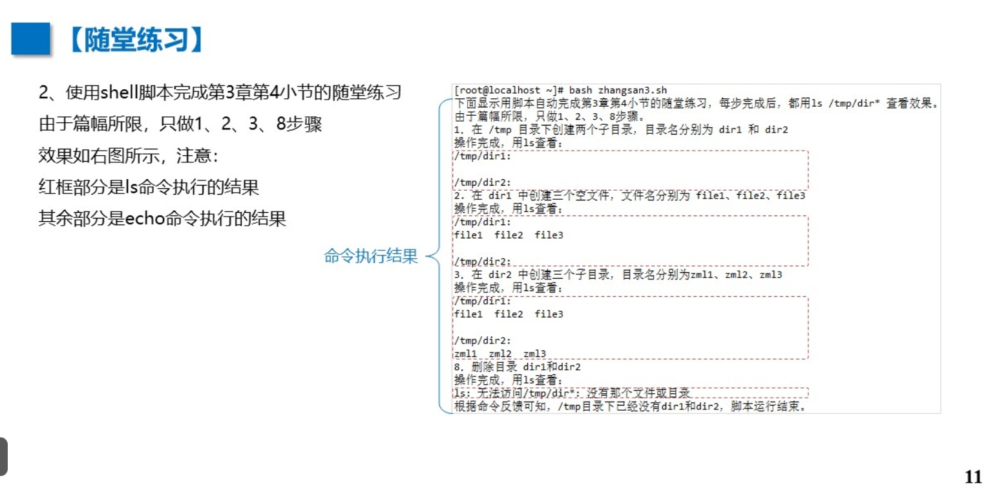
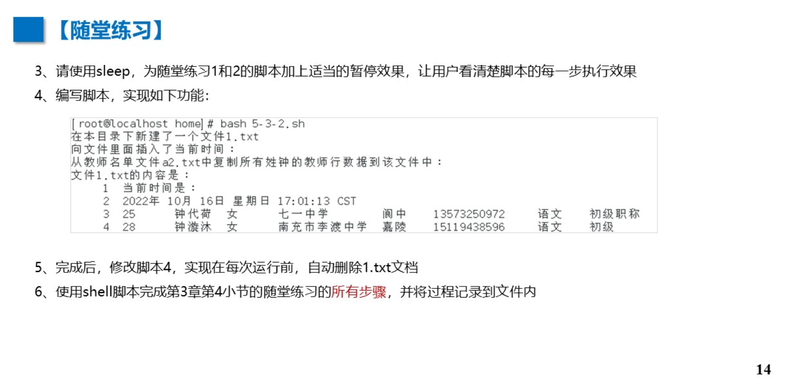
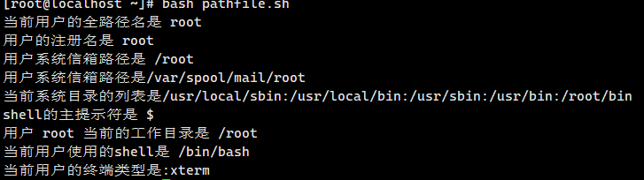
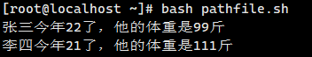
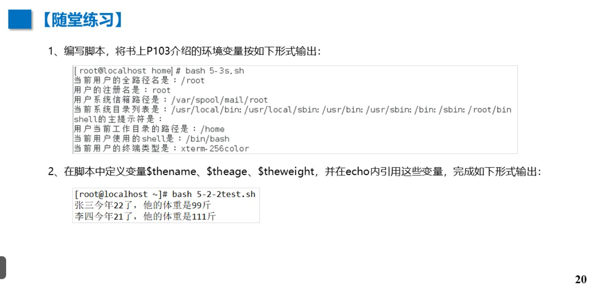
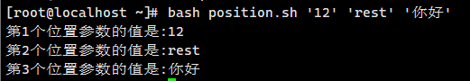
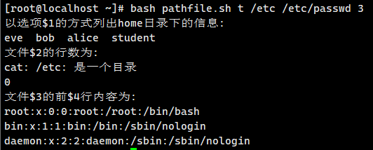
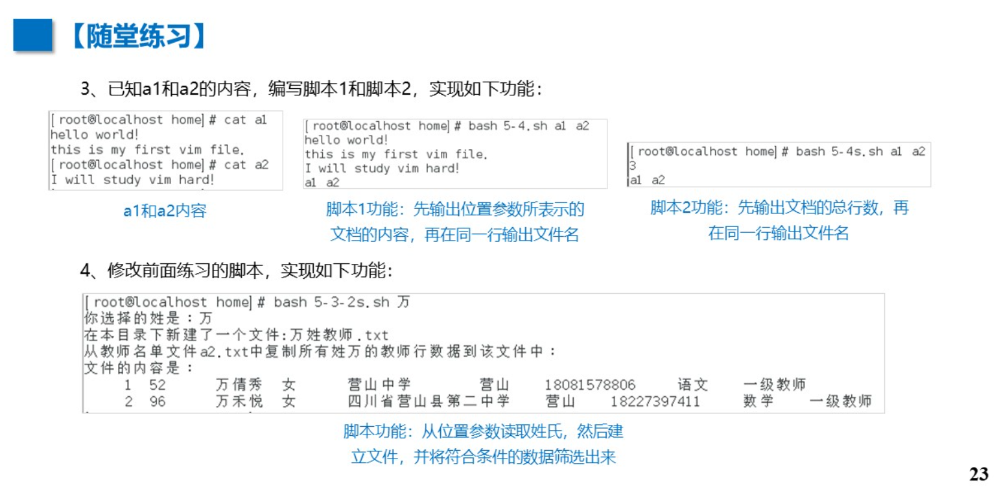
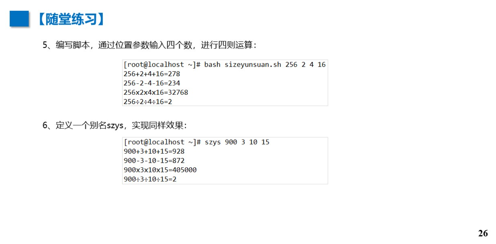

# shell 脚本

# #！ /bin/bash

# 1 创建

```
vim ex01.sh
#! /bin/bash
#用 /bin/bash 的sh脚本
date
pwd
cat /etc/ssh 
```


# 2 执行

```
bash ex01.sh
```


# 3 交互

```
#! /bin/bash
#用 /bin/bash 的sh脚本
echo '输出日期'
date
echo '当前目录'
pwd
echo '查看'
cat /etc/ssh 
```

## -n	同行输出

```
echo -n '123'
echo -n '456'
```


## sleep	等待 

```
echo '等待2秒后显示第二行'
sleep 2
echo '第二行'
```


P10 随堂练

```
#1
vim zhangsan1.sh
echo '大家好，我是张三。'
echo '今天的日期和时间是:'
date
echo '我的生日是2002年6月1日:'
cal 1 6 2002

echo 'etc目录下的passwd文件的行数是：'
wc -l /etc/passwd 

```


## P11 随堂练

```
#2
vim zhangsan3.sh

echo '下面显示用脚本自动完成第3章第4小节的随堂练习，每步完成后，都用1s /tmp/dir*查看效果。由于篇幅所限，只做1、2、3、8步骤，'
echo '1.在 /tmp 目录下创建两个子目录，目录名分别为 dir1 和 dir2'
mkdir /tmp/dir1
mkdir /tmp/dir2
ls /tmp

echo '2.在 dir1 中创建三个空文件，文件名分别为 file1、file2、file3'
mkdir -p /tmp/dir1 
touch /tmp/dir1/file1 /tmp/dir1/file2 /tmp/dir1/file3
ls /tmp/dir1

echo '3，在 dir2 中创建三个子目录，目录名分别为zm11、zm12、zm13'
mkdir -p /tmp/dir2/zml1
mkdir -p /tmp/dir2/zml2
mkdir -p /tmp/dir2/zml3
ls /tmp/dir2

echo '8.删除目录 dir1和dir2'
rm -rf /tmp/dir1 /tmp/dir2
ls /tmp/dir1 
ls /tmp/dir2


bash zhangsan3.sh
```




# 4 输出重定向

```
vim ex02.sh
#!/bin/bash
#建立日志文件，记录指定目录的变化和系统用户数，如下:
#新建一个文件，将当前日期时间，/root目录下的列表信息，以及passwd文件的行数写入该文件内
echo '开始执行脚本，记录相关信息，并输出到record.txt文件内：'
touch /tmp/record.txt
echo -n '当前的时期和时间是:' >> /tmp/record.txt
date >>/tmp/record.txt
echo'当前root日录下的文件和目录列表是:' >> /tmp/record.txt
ls -alt /root >>/tmp/record.txt
echo -n 'passwd配置文件的行数是:' >> /tmp/record.txt
cat /etc/passwdwc -l >> /tmp/record.txt
echo'记录完毕，使用cat /tmp/record.txt可查看本次日志信息.'

bash ex02.sh

cat /tmp/record.txt
```


## P14 随堂练

```
#3
echo '大家好，我是张三。'
sleep 2
echo '今天的日期和时间是:'
date
sleep 2
echo '我的生日是2002年6月1日:'
cal 1 6 2002
sleep 2

echo 'etc目录下的passwd文件的行数是：'
wc -l /etc/passwd 
sleep 2


echo '下面显示用脚本自动完成第3章第4小节的随堂练习，每步完成后，都用1s /tmp/dir*查看效果。由于篇幅所限，只做1、2、3、8步骤，'
echo '1.在 /tmp 目录下创建两个子目录，目录名分别为 dir1 和 dir2'
mkdir /tmp/dir1
mkdir /tmp/dir2
ls /tmp

sleep 2
echo '2.在 dir1 中创建三个空文件，文件名分别为 file1、file2、file3'
mkdir -p /tmp/dir1 
touch /tmp/dir1/file1 /tmp/dir1/file2 /tmp/dir1/file3
ls /tmp/dir1

sleep 2
echo '3，在 dir2 中创建三个子目录，目录名分别为zm11、zm12、zm13'
mkdir -p /tmp/dir2/zml1
mkdir -p /tmp/dir2/zml2
mkdir -p /tmp/dir2/zml3
ls /tmp/dir2

sleep 2
echo '8.删除目录 dir1和dir2'
rm -rf /tmp/dir1 /tmp/dir2
ls /tmp/dir1 
ls /tmp/dir2

#4
vim 5-3-2.sh
wget http://172.16.198.15:9936/download/a1.txt
echo '在本目录下新建了一个文件1.txt'
touch 1.txt
echo '向文件里面插入了当前时间：'
date
date >> 1.txt
echo '从教师名单文件a2.txt中复制所有姓名的教师行数据到该文件中:'
cp a2.txt 1.txt
echo '文件1.txt的内容是：'

echo '当前时间是：'
date
grep -E '钟.*女|女.*钟' a1.txt

bash 5-3-2.sh

#5
 #4
 rm -f /etc/1.txt


#6
vim 5-3-2.sh

set -o xtrace
mkdir /tmp/dir1
mkdir /tmp/dir2

mkdir -p /tmp/dir1 
touch /tmp/dir1/file1 /tmp/dir1/file2 /tmp/dir1/file3

mkdir -p /tmp/dir2/zml1
mkdir -p /tmp/dir2/zml2
mkdir -p /tmp/dir2/zml3

cp /tmp/dir1/file1 /tmp/dir2/zml2/fileback1

mv /tmp/dir1/file2 /tmp/dir2/zml1/fileback2

cp -a /tmp/dir2 /tmp/dir1

ln -s /tmp/dir1/file3 linktofile3

rm -rf /tmp/dir1 /tmp/dir2

```



# 5 变量

## ①环境变量	set

### 	HOME:			当前用户的默认主目录

### 	HOSTNAME:  计算机的主机名

### 	LOGNAME:	已登录系统的用户名

### 	PATH:			 shell从中查找命令的目录列表

### 	PWD:		 	 用户当前工作目录的路径

### TERM：		 用户终端类型

### 	SHELL:		  用户当前使用的shel


```
例：
#!/bin/bash
#显示环境变量的值
echo '当前登录的用户是' $LOGNAME
echo '当前用户的家目录是' $HOME
echo '用户' $LOGNAME' 当前的工作目录是' $PWD
echo '当前用户使用的she11是' $SHELL


#如果在 ~
vim pathfile.sh
bash pathfile.sh
当前登录的用户是 root

当前用户的家目录是 /root
用户 root 当前的工作目录是 /root
当前用户使用的she11是 /bin/bash
---------------------------------------
#如果在 /etc
cd /etc
vim pathfile.sh
bash pathfile.sh

当前登录的用户是 root
当前用户的家目录是 /root
用户 root 当前的工作目录是 /etc
当前用户使用的she11是 /bin/bash


```


## ②用户自定义变量  （与Py变量原理相同）

### 	$  引用

```
例：
#!/bin/bash
#显示环境变量的值
nums=10
guest='张三'
echo  $guest '一顿饭能吃' $nums '个包子'

张三 一顿饭能吃 10 个包子
```


## P20 随堂练

```
#1
vim pathfile.sh

#!/bin/bash
#显示环境变量的值
echo '当前用户的全路径名是' $LOGNAME
echo '用户的注册名是' $LOGNAME
echo '用户系统信箱路径是' $PWD
export email="/var/spool/mail/root"
echo '用户系统信箱路径是'$email
echo '当前系统目录的列表是'$PATH
echo 'shell的主提示符是' $
echo '用户' $LOGNAME' 当前的工作目录是' $PWD
echo '当前用户使用的shell是' $SHELL
echo '当前用户的终端类型是:'$TERM

bash pathfile.sh

#2
vim pathfile.sh

#!/bin/bash
thename1='张三'
theage1='22'
theweight1='99'
thename2='李四'
theage2='21'
theweight2='111'
echo "$thename1今年$theage1了，他的体重是$theweight1斤"
echo "$thename2今年$theage2了，他的体重是$theweight2斤"

bash pathfile.sh
```










# 6 位置参数(形参：实参)

```
vim position.sh 

#!/bin/bash
#形参传实参
echo '第1个位置参数的值是:'$1
echo '第2个位置参数的值是:'$2
echo '第3个位置参数的值是:'$3

bash position.sh '12' 'rest' '你好'

#也可作命令
vim position.sh 

#!/bin/bash
echo '以选项$1的方式列出home日录下的信息:'
ls -$1 /home
echo '文件$2的行数为:'
cat $2 | wc -l
echo '文件$3的前$4行内容为:'
head -$4 $3

bash pathfile.sh t /etc /etc/passwd 3
```






## P23 随堂练

```
#3
vim a1
hello world！
this is my first vim file.
vim a2
I will study vim hard!

vim 5-4-1.sh 

#!/bin/bash
cat $1
cat $2
echo -n $1 ;echo $2

bash 5-4-1.sh a1 a2


vim 5-4-2.sh 

#!/bin/bash
wc -l a1 a2
echo -n $1 ;echo $2


bash 5-4-2.sh a1 a2

#4
vim 5-3-2s.sh 

echo '你选择的姓是：' $1
echo '在本目录下新建了一个文件：' $1 '姓教师.txt'
touch $1.txt
echo '从教室名单文件a2.txt中复制所有姓万的教师行数据到该文件中：'
grep -n '万' a1.txt > temp.txt
cp temp.txt $1.txt
echo '文件的内容是：'
cat $1.txt
rm temp.txt

bash 5-3-2s.sh 万
```



# 7 命令替换

```
vim replace.sh

#!/bin/bash#使用反引号将命令输出赋给变量
time= `date`
echo '今天的日期和时间是:$time'

bash replace.sh
```


# 8 算数运算

```
vim arithmetic.sh

#!/bin/bash
var1=100
var2=50
var3=45
var4=$((var1 * (var2 - var3)))
echo '运算结果是:' $var4

bash arithmetic.sh
```


## P26 随堂练

```
#5
vim 5-3-5.sh

#!/bin/bash
a=$1
b=$2
c=$3
d=$4
echo  $a '+' $b '+' $c '+' $d '= '$((a+b+c+d))
echo  $a '-' $b '-' $c '-' $d '= '$((a-b-c-d))
echo  $a 'x' $b 'x' $c 'x' $d '= '$((a*b*c*d))
echo  $a '÷' $b '÷' $c '÷' $d '= ' $(echo "scale=4; $a/$b/$c/$d" | bc)

bash arithmetic.sh 256 2 4 16

#6
alias szys="bash arithmetic.sh"
vim szys
a=$1
b=$2
c=$3
d=$4
echo  $a '+' $b '+' $c '+' $d '= '$((a+b+c+d))
echo  $a '-' $b '-' $c '-' $d '= '$((a-b-c-d))
echo  $a 'x' $b 'x' $c 'x' $d '= '$((a*b*c*d))
echo  $a '÷' $b '÷' $c '÷' $d '= ' $(echo "scale=4; $a/$b/$c/$d" | bc)

szys 900 3 10 15
```




