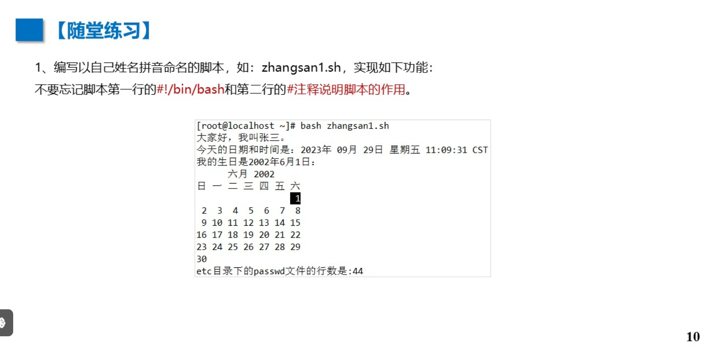
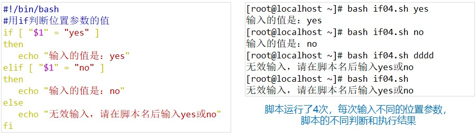
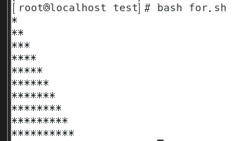
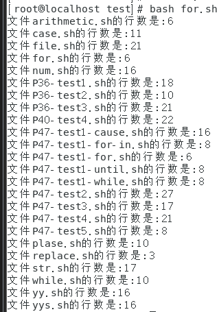
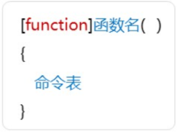

# Linux 第5章 shell 编程

http://172.16.198.15:9936/z05.html

# shell 脚本

# #！ /bin/bash

# 1 创建

```
vim ex01.sh
#! /bin/bash
#用 /bin/bash 的sh脚本
date
pwd
cat /etc/ssh 
```


# 2 执行

```
bash ex01.sh
```


# 3 交互

```
#! /bin/bash
#用 /bin/bash 的sh脚本
echo '输出日期'
date
echo '当前目录'
pwd
echo '查看'
cat /etc/ssh 
```

## -n	同行输出

```
echo -n '123'
echo -n '456'
```


## sleep	等待 

```
echo '等待2秒后显示第二行'
sleep 2
echo '第二行'
```


P10 随堂练

```
#1
vim zhangsan1.sh
echo '大家好，我是张三。'
echo '今天的日期和时间是:'
date
echo '我的生日是2002年6月1日:'
cal 1 6 2002

echo 'etc目录下的passwd文件的行数是：'
wc -l /etc/passwd 

```




## P11 随堂练

```
#2
vim zhangsan3.sh

echo '下面显示用脚本自动完成第3章第4小节的随堂练习，每步完成后，都用1s /tmp/dir*查看效果。由于篇幅所限，只做1、2、3、8步骤，'
echo '1.在 /tmp 目录下创建两个子目录，目录名分别为 dir1 和 dir2'
mkdir /tmp/dir1
mkdir /tmp/dir2
ls /tmp

echo '2.在 dir1 中创建三个空文件，文件名分别为 file1、file2、file3'
mkdir -p /tmp/dir1 
touch /tmp/dir1/file1 /tmp/dir1/file2 /tmp/dir1/file3
ls /tmp/dir1

echo '3，在 dir2 中创建三个子目录，目录名分别为zm11、zm12、zm13'
mkdir -p /tmp/dir2/zml1
mkdir -p /tmp/dir2/zml2
mkdir -p /tmp/dir2/zml3
ls /tmp/dir2

echo '8.删除目录 dir1和dir2'
rm -rf /tmp/dir1 /tmp/dir2
ls /tmp/dir1 
ls /tmp/dir2


bash zhangsan3.sh
```


# 4 输出重定向

```
vim ex02.sh
#!/bin/bash
#建立日志文件，记录指定目录的变化和系统用户数，如下:
#新建一个文件，将当前日期时间，/root目录下的列表信息，以及passwd文件的行数写入该文件内
echo '开始执行脚本，记录相关信息，并输出到record.txt文件内：'
touch /tmp/record.txt
echo -n '当前的时期和时间是:' >> /tmp/record.txt
date >>/tmp/record.txt
echo'当前root日录下的文件和目录列表是:' >> /tmp/record.txt
ls -alt /root >>/tmp/record.txt
echo -n 'passwd配置文件的行数是:' >> /tmp/record.txt
cat /etc/passwdwc -l >> /tmp/record.txt
echo'记录完毕，使用cat /tmp/record.txt可查看本次日志信息.'

bash ex02.sh

cat /tmp/record.txt
```


## P14 随堂练

```
#3
echo '大家好，我是张三。'
sleep 2
echo '今天的日期和时间是:'
date
sleep 2
echo '我的生日是2002年6月1日:'
cal 1 6 2002
sleep 2

echo 'etc目录下的passwd文件的行数是：'
wc -l /etc/passwd 
sleep 2


echo '下面显示用脚本自动完成第3章第4小节的随堂练习，每步完成后，都用1s /tmp/dir*查看效果。由于篇幅所限，只做1、2、3、8步骤，'
echo '1.在 /tmp 目录下创建两个子目录，目录名分别为 dir1 和 dir2'
mkdir /tmp/dir1
mkdir /tmp/dir2
ls /tmp

sleep 2
echo '2.在 dir1 中创建三个空文件，文件名分别为 file1、file2、file3'
mkdir -p /tmp/dir1 
touch /tmp/dir1/file1 /tmp/dir1/file2 /tmp/dir1/file3
ls /tmp/dir1

sleep 2
echo '3，在 dir2 中创建三个子目录，目录名分别为zm11、zm12、zm13'
mkdir -p /tmp/dir2/zml1
mkdir -p /tmp/dir2/zml2
mkdir -p /tmp/dir2/zml3
ls /tmp/dir2

sleep 2
echo '8.删除目录 dir1和dir2'
rm -rf /tmp/dir1 /tmp/dir2
ls /tmp/dir1 
ls /tmp/dir2

#4
vim 5-3-2.sh
wget http://172.16.198.15:9936/download/a1.txt
echo '在本目录下新建了一个文件1.txt'
touch 1.txt
echo '向文件里面插入了当前时间：'
date
date >> 1.txt
echo '从教师名单文件a2.txt中复制所有姓名的教师行数据到该文件中:'
cp a2.txt 1.txt
echo '文件1.txt的内容是：'

echo '当前时间是：'
date
grep -E '钟.*女|女.*钟' a1.txt

bash 5-3-2.sh

#5
 #4
 rm -f /etc/1.txt


#6
vim 5-3-2.sh

set -o xtrace
mkdir /tmp/dir1
mkdir /tmp/dir2

mkdir -p /tmp/dir1 
touch /tmp/dir1/file1 /tmp/dir1/file2 /tmp/dir1/file3

mkdir -p /tmp/dir2/zml1
mkdir -p /tmp/dir2/zml2
mkdir -p /tmp/dir2/zml3

cp /tmp/dir1/file1 /tmp/dir2/zml2/fileback1

mv /tmp/dir1/file2 /tmp/dir2/zml1/fileback2

cp -a /tmp/dir2 /tmp/dir1

ln -s /tmp/dir1/file3 linktofile3

rm -rf /tmp/dir1 /tmp/dir2

```


# 5 变量

## ①环境变量	set

### 	HOME:			当前用户的默认主目录

### 	HOSTNAME:  计算机的主机名

### 	LOGNAME:	已登录系统的用户名

### 	PATH:			 shell从中查找命令的目录列表

### 	PWD:		 	 用户当前工作目录的路径

### TERM：		 用户终端类型

### 	SHELL:		  用户当前使用的shell


```
例：
#!/bin/bash
#显示环境变量的值
echo '当前登录的用户是' $LOGNAME
echo '当前用户的家目录是' $HOME
echo '用户' $LOGNAME' 当前的工作目录是' $PWD
echo '当前用户使用的she11是' $SHELL


#如果在 ~
vim pathfile.sh
bash pathfile.sh
当前登录的用户是 root

当前用户的家目录是 /root
用户 root 当前的工作目录是 /root
当前用户使用的she11是 /bin/bash
---------------------------------------
#如果在 /etc
cd /etc
vim pathfile.sh
bash pathfile.sh

当前登录的用户是 root
当前用户的家目录是 /root
用户 root 当前的工作目录是 /etc
当前用户使用的she11是 /bin/bash

```


## ②用户自定义变量  （与Py变量原理相同）

### 	$  引用

```
例：
#!/bin/bash
#显示环境变量的值
nums=10
guest='张三'
echo  $guest '一顿饭能吃' $nums '个包子'

张三 一顿饭能吃 10 个包子
```


## P20 随堂练

```
#1
vim pathfile.sh

#!/bin/bash
#显示环境变量的值
echo '当前用户的全路径名是' $LOGNAME
echo '用户的注册名是' $LOGNAME
echo '用户系统信箱路径是' $PWD
export email="/var/spool/mail/root"
echo '用户系统信箱路径是'$email
echo '当前系统目录的列表是'$PATH
echo 'shell的主提示符是' $
echo '用户' $LOGNAME' 当前的工作目录是' $PWD
echo '当前用户使用的shell是' $SHELL
echo '当前用户的终端类型是:'$TERM

bash pathfile.sh

#2
vim pathfile2.sh

#!/bin/bash
thename1='张三'
theage1='22'
theweight1='99'
thename2='李四'
theage2='21'
theweight2='111'
echo "$thename1今年$theage1了，他的体重是$theweight1斤"
echo "$thename2今年$theage2了，他的体重是$theweight2斤"

bash pathfile2.sh
```


# 6 位置参数(形参：实参)

```
vim position.sh 

#!/bin/bash
#形参传实参
echo '第1个位置参数的值是:'$1
echo '第2个位置参数的值是:'$2
echo '第3个位置参数的值是:'$3

bash position.sh '12' 'rest' '你好'

#也可作命令
vim position.sh 

#!/bin/bash
echo '以选项$1的方式列出home日录下的信息:'
ls -$1 /home
echo '文件$2的行数为:'
cat $2 | wc -l
echo '文件$3的前$4行内容为:'
head -$4 $3

bash pathfile.sh t /etc /etc/passwd 3
```


## P23 随堂练

```
#3
vim a1
hello world！
this is my first vim file.
vim a2
I will study vim hard!

vim 5-4-1.sh 

#!/bin/bash
cat $1
cat $2
echo -n $1 ;echo $2

bash 5-4-1.sh a1 a2


vim 5-4-2.sh 

#!/bin/bash
wc -l a1 a2
echo -n $1 ;echo $2


bash 5-4-2.sh a1 a2

#4
vim 5-3-2s.sh 

echo '你选择的姓是：' $1
echo '在本目录下新建了一个文件：' $1 '姓教师.txt'
touch $1.txt
echo '从教室名单文件a2.txt中复制所有姓万的教师行数据到该文件中：'
grep -n '万' a1.txt > temp.txt
cp temp.txt $1.txt
echo '文件的内容是：'
cat $1.txt
rm temp.txt

bash 5-3-2s.sh 万
```


# 7 命令替换

```
vim replace.sh

#!/bin/bash
time= 'date'
echo '今天的日期和时间是:$time'

bash replace.sh
```


# 8 算数运算

```
vim arithmetic.sh

#!/bin/bash
var1=100
var2=50
var3=45
var4=$((var1 * (var2 - var3)))
echo '运算结果是:' $var4

bash arithmetic.sh
```


## P26 随堂练

```
#5
vim 5-3-5.sh

#!/bin/bash
a=$1
b=$2
c=$3
d=$4
echo  $a '+' $b '+' $c '+' $d '= '$((a+b+c+d))
echo  $a '-' $b '-' $c '-' $d '= '$((a-b-c-d))
echo  $a 'x' $b 'x' $c 'x' $d '= '$((a*b*c*d))
echo  $a '÷' $b '÷' $c '÷' $d '= ' $(echo "scale=4; $a/$b/$c/$d" | bc)

bash arithmetic.sh 256 2 4 16

#6
alias szys="bash arithmetic.sh"
vim szys
a=$1
b=$2
c=$3
d=$4
echo  $a '+' $b '+' $c '+' $d '= '$((a+b+c+d))
echo  $a '-' $b '-' $c '-' $d '= '$((a-b-c-d))
echo  $a 'x' $b 'x' $c 'x' $d '= '$((a*b*c*d))
echo  $a '÷' $b '÷' $c '÷' $d '= ' $(echo "scale=4; $a/$b/$c/$d" | bc)

szys 900 3 10 15
```


# 9 控制结构

## ① if-then-else-fi		if-then-elif-then-else-fi

### Ⅰ 字符串：

#### =	等于

#### !=	不等于

#### -n	s1	长度>0  T

#### -z	s1	长度=0  T


### Ⅱ	数字：

#### -eq	=

#### -ne	!=

#### -gt	>

#### -ge	>=

#### -lt	<

#### -le	<=


### Ⅲ	文件：

#### -e	存在

#### -d	目录

#### -f	普通文件

#### -s	非空

#### -r	可读文件

#### -w	可写文件

#### -x	可执行文件


### [] 括号与内容之间、内容与操作符号之间都要留有空格

#### #例	Ⅰ 字符串

```
#!/bin/bash
#if语句，用于字符串比较
a1='aalab'
a2='aalac'
a3='cc'
if [ "$a1" = "$a2" ]
then
    echo '相等!'
else
    echo '不相等!'
fi

#判断字符串长度是否大于0
if [ -n "$a3" ]
then
    echo "$a3 长度大于0!"
fi
```


#### #例	Ⅱ 数字

```
#!/bin/bash
#两组if语句，用于数字比较
value1=10
value2=11
#
if [ $value1 -gt 5 ]
then
    echo '第一个数比5大'
fi
#
if [ $value1 -eq $value2 ]
then
    echo '两个数相等'
else
    echo '两个数不相等'
fi
```


#### #例	Ⅲ 文件

```
#!/bin/bash
#if语句，用于文件类型判断
test_dir='/home/jerry'
test_file='/root/456.txt'

if [ -d "$test_dir" ]
then
    echo "目录 $test_dir 存在，内容数量有:"
    ls -al "$test_dir" | wc -l
else
    echo "目录 $test_dir 不存在"
fi

#判断文件是否存在，若存在则显示其内容
if [ -f "$test_file" ]
then
    echo "文件 $test_file 存在，内容为:"
    cat "$test_file"
fi
```


#### #例 Ⅳ 位置参数

```
#!/bin/bash
if [ "$1" = "yes" ]
then
    echo '输入的值是:yes'
elif [ "$1" = "no" ]
then
    echo '输入的值是:no'
else
    echo '无效输入，请在脚本名后输入yes或no'
fi
```




#### #例 Ⅴ 交互

```
#!/bin/bash
#用if判断文件类型
echo '该脚本用于判断文件的类型。'
read -p '请输入文件名:' toread
if [ -z "$toread" ]
then
    echo '无效输入!'
elif [ -f "$toread" ]
then
    echo '$toread是一个普通文件'
elif [ -d "$toread" ]
then
    echo '$toread是一个目录'
else
    echo '输入错误!'
fi
```


#### #例 Ⅵ 命令

```
#!/bin/bash
#用if判断命令是否成功执行
#显示当前工作目录
if pwd
then
    echo '列出了当前工作目录'
else
    echo '无法列出当前目录'
fi
#进入一个不存在的目录
if cd /121212
then
    echo '进入了目录/121212'
else
    echo '无法进入该目录，请检查目录名是否正确'
fi
```


## P36	随堂练

```
#1 
vim P36-test1.sh

#!/bin/bash
echo '请输入数字a：'
read a
echo '请输入数字b：'
read b

if [ -z "$a" ] && [ -z "$b" ]
then
    echo '无效输入!'
elif [ "$a" -eq "$b" ]
then
    echo '等于'
elif [ "$a" -gt "$b" ]
then
    echo "$a 大于 $b"
else
    echo "$a 小于 $b"
fi

bash P36-test1.sh

#2
vim P36-test2.sh

#!/bin/bash

file=$1
if [ -f "$file" ]; then
    echo "$file 是一个普通文件"
elif [ -d "$file" ]; then
    echo "$file 是一个目录文件"
elif [ -L "$file" ]; then
    echo "$file 是一个符号链接文件"
else
    echo "$file 是其他类型的文件"
fi

bash P36-test2.sh


#3
vim P36-test3.sh

#!/bin/bash
echo "请输入语文成绩:"
read chinese_score
echo "请输入数学成绩:"
read math_score 
echo "请输入英语成绩:"
read english_score

total_score=$((chinese_score + math_score + english_score))
average_score=$((total_score / 3))

if [ $total_score -ge 240 ]; then
    echo "总成绩为: $total_score 分"
    echo "平均成绩为: $average_score 分,优秀"
elif [ $total_score -ge 180 -a $total_score -le 240 ]; then
    echo "总成绩为: $total_score 分" 
    echo "平均成绩为: $average_score 分,良好"
else
    echo "总成绩为: $total_score 分"
    echo "平均成绩为: $average_score 分,差"
fi

bash P36-test2.sh
```


## ②case  依次比较


```
#case-表达式(变量)-关键字 in - ) -- ;;     都不匹配,执行 * 对应命令序列
#格式：
case 表达式 in
    1)
        命令1
        ;;
    2)
        命令2
        命令3
        ;;
    *)
        否则命令
        ;;
esac

#例：   |  或
vim case.sh

#!/bin/bash
read -p '输入任意一个字符，然后敲回车键:' KEY
case $KEY in
	[a-z]|[A-Z])
		echo '你输入的是字母';;
	[0-9])
		echo '你输入的是数字';;
	*)
		echo '你输入的是功能键、空格或其他符号';;
esac


bash case.sh
```


## P40 随堂练

```
#4
vim P40-test4.sh

#!/bin/bash

echo "请输入您的分数(0-100):"
read score

case $score in
    [9][0-9]|100)
        echo "优秀"
        ;;
    [7-8][0-9])
        echo "良好"
        ;;
    6[0-9])
        echo "及格"
        ;;
    [0-5][0-9])
        echo "不及格"
        ;;
    *)
        echo "请输入0-100之间的数字"
        ;;
esac

bash P40-test4.sh
```


## ③for((;;))-do-命令表-done

```
#格式
for((初值;条件;变量变化))
do
	命令表
done

#例

#!/bin/bash
for((i=1;i<= 10; i++ ))
do
	echo "当前的循环值是:$i"
done

```


### for 嵌套

```
#格式：
for((初值1;条件;初值变化1))
do
	for((初值2;条件;初值变化2))
		do
	命令表
	done
done

#例

#!/bin/bash
for((i=1;i<= 10; i++ ))
do
	for(( j=1;j<= $i; j++ ))
	do
		echo -n '*'
	done
	echo ' '
done
```





### for 遍历

```
#格式
for 变量 in 正则表达式
do
	命令
done

#例
#!/bin/bash
for file in *.sh
do
	lines=`cat $file | wc -l`
	echo "文件$file的行数是:$lines"
done
```




## ③while 

```
#格式
while [条件]
do
	命令
done

#例
#!/bin/bash
a1=1
sum=0
while [ $a1 -le 10 ]
do
    echo "当前是第 $a1 次循环"
    sum=$((sum + a1))
    a1=$((a1 + 1))
done
echo "1 到 10 的累加和是: $sum"
```


## ④until

```
#格式
until [条件]
do
	命令
done

#例
#!/bin/bash
i=0
result=0
until [ $i -ge 5 ]
do
    i=$((i+1))
    j=$((i*2))
    result=$((result+j))
    echo '第'"$i"'次计算结束'
done
echo '前5个偶数之和是:'"$result"
```


## P47 随堂练

```
#1
#for
vim P47-test1-for.sh

#!/bin/bash
factorial=1
for i in {1..10}; do
    factorial=$((factorial * i))
done
echo "The factorial of 1-10 is: $factorial"

bash P47-test1-for.sh


#while
vim P47-test1-while.sh

#!/bin/bash
factorial=1
i=1
while [ $i -le 10 ]; do
    factorial=$((factorial * i))
    i=$((i + 1))
done
echo "The factorial of 1-10 is: $factorial"

bash P47-test1-while.sh


vim P47-test1-for-in.sh

#!/bin/bash
factorial=1
for i in {1..10}; do
    factorial=$((factorial * i))
done
echo "The factorial of 1-10 is: $factorial"

bash P47-test1-for-in.sh

vim P47-test1-until.sh

#!/bin/bash
factorial=1
i=1
until [ $i -gt 10 ]; do
    factorial=$((factorial * i))
    i=$((i + 1))
done
echo "The factorial of 1-10 is: $factorial"

bash P47-test1-until.sh

vim P47-test1-cause.sh

#!/bin/bash
factorial=1
i=1
case $i in
    1) factorial=$((factorial * i)); i=$((i + 1));;
    2) factorial=$((factorial * i)); i=$((i + 1));;
    3) factorial=$((factorial * i)); i=$((i + 1));;
    4) factorial=$((factorial * i)); i=$((i + 1));;
    5) factorial=$((factorial * i)); i=$((i + 1));;
    6) factorial=$((factorial * i)); i=$((i + 1));;
    7) factorial=$((factorial * i)); i=$((i + 1));;
    8) factorial=$((factorial * i)); i=$((i + 1));;
    9) factorial=$((factorial * i)); i=$((i + 1));;
    10) factorial=$((factorial * i)); i=$((i + 1));;
esac
echo "The factorial of 1-10 is: $factorial"

bash P47-test1-cause.sh

#2
vim P47-test2.sh

#!/bin/bash
echo "请输入一个大于10的数:"
read num

until [ $num -gt 10 ]
do
    echo "输入的数字必须大于10,请重新输入."
    read num
done

odd_sum=0
even_sum=0
i=1

until [ $i -gt $num ]
do
    if [ $((i % 2)) -eq 0 ]
    then
        ((even_sum += i))
    else
        ((odd_sum += i))
    fi
    ((i += 1))
done

echo "从1到$num之间所有奇数的和为: $odd_sum"
echo "从1到$num之间所有偶数的和为: $even_sum"

bash P47-test2.sh

#3
vim P47-test3.sh

#!/bin/bash
echo "请输入您的姓名:"
read name

for ((i=1; i<=20; i++))
do
    if [ $i -lt 10 ]
    then
        filename="/tmp/${name}0$i.txt"
    else
        filename="/tmp/${name}$i.txt"
    fi
    touch $filename
done

echo "已在/tmp目录下创建了20个文件,文件名为'${name}01.txt'到'${name}20.txt'。"

bash P47-test3.sh
```


```
#4
vim P47-test4.sh

#!/bin/bash
echo "Contents of /boot directory:"
echo "Directories:"
count_dirs=0
for item in /boot/*; do
    if [ -d "$item" ]; then
        echo "- $item"
        count_dirs=$((count_dirs + 1))
    fi
done
echo "Number of directories: $count_dirs"

echo "Regular files:"
count_files=0
for item in /boot/*; do
    if [ -f "$item" ]; then
        echo "- $item"
        count_files=$((count_files + 1))
    fi
done
echo "Number of regular files: $count_files"

bash P47-test4.sh
#5
vim P47-test5.sh
#!/bin/bash
echo "九九乘法表:"
for i in {1..9}; do
    for j in {1..9}; do
        printf "%2d x %-2d = %-4d" $i $j $((i*j))
    done
    echo
done

bash P47-test5.sh
```


## ⑥continue

```
#例
#!/bin/bash
for i in 1 2 3 4 5 6
do
    if [ $i -eq 3 ]
    then
        continue
    else
        echo "第${i}次循环"
    fi
done
echo "程序结束!!"

```


## ⑦break

```
#!/bin/bash
a=0
while true
do
    echo $a
    if [ $a -eq 5 ]
    then
        break
    fi
    a=$((a+1))
done
echo '程序结束!!'
```


## ⑧exit

```
#!/bin/bash
for i in 1 2 3 4 5 6
do
    if [ $i -eq 3 ]
    then
        exit
    else
        echo "第${i}次循环"
    fi
done
echo '程序结束!!'
```


# 10 函数

## 重复多次调用

```
#格式
[function]函数名()
{
命令表
}

#例
#!/bin/bash
function func1 {
 echo 'simple function example!'
}
count=1
while [ $count -le 5 ]
do
 func1
 count=$[ $count + 1 ]
done
echo 'while loop ended'
func1
```




## 传参

```
#例
#!/bin/bash
displayweek(){
case $1 in
1)echo '星期一';;
2)echo '星期二';;
3)echo '星期三';;
4)echo '星期四';;
5)echo '星期五';;
6)echo '星期六';;
7)echo '星期天';;
*)echo '输入错误';;
esac
}
while true
do
	read -p '输入表示星期的数:' num
	displayweek $num
	read -p '继续(q退出，任意键继续)?' answer
	if [ "$answer" = 'q' ]
	then
		break
	fi
done
```


## P57 随堂练

```
#1 
vim P57-test1.sh

#!/bin/bash
function compare_numbers() {
    echo '请输入数字a：'
    read a
    echo '请输入数字b：'
    read b

    if [ -z "$a" ] || [ -z "$b" ]
    then
        echo '无效输入!'
    elif [ "$a" -eq "$b" ]
    then
        echo "$a 等于 $b"
    elif [ "$a" -gt "$b" ]
    then
        echo "$a 大于 $b"
    else
        echo "$a 小于 $b"
    fi
    
    echo "是否继续(y/n)?"
    read continue
    
    if [ "$continue" != "y" ]; then
        return
    fi
}
while true; do
    compare_numbers
done

bash P57-test1.sh

#3
vim P57-test2.sh

#!/bin/bash
function calculate_score() {
    echo "请输入语文成绩:"
    read chinese_score
    echo "请输入数学成绩:"
    read math_score
    echo "请输入外语成绩:"
    read english_score

    total_score=$((chinese_score + math_score + english_score))
    average_score=$((total_score / 3))

    if [ $total_score -ge 240 ]; then
        echo "总分是:$total_score"
        echo "平均分是:$average_score"
        echo "你的分数等级是:优秀!"
    elif [ $total_score -ge 180 -a $total_score -le 240 ]; then
        echo "总分是:$total_score"
        echo "平均分是:$average_score"
        echo "你的分数等级是:合格!"
    else
        echo "总分是:$total_score"
        echo "平均分是:$average_score"
        echo "你的分数等级是:不及格!"
    fi
    
    echo "是否继续(y/n)?"
    read continue
    if [ "$continue" != "y" ]; then
        exit
    fi
}
while true; do
    calculate_score
done

bash P57-test2.sh
```


