# Linux 第6章 用户和权限管理

http://172.16.198.15:9936/z06.html

# 1	账号的管理

## useradd			添加

```
useradd	[选项]用户名
#例
useradd tom
```


## passwd		密码

```
passwd tom
```


## su 					切换登录

```
su tom  和 su - tom 一样
```


## userdel			删除用户

```
userdel [选项] 用户名
#例(同时删除家目录)
userdel -r tom
```


## P10 随堂练

```
#1
useradd zhangsan1
passwd zhangsan1

useradd zhangsan2
passwd zhangsan2

#2
su - zhangsan1
123
su - zhangsan2
456
exit

#3
file-open-new
name：zhangsan1
host 172.16.128.139
ok-zhangsan1-count-输入：zhangsan1-输入密码


#4	权限不够
cat ~
mkdir /123

#5	成功
vim hello.txt
I am back!

#6 成功
ls -l
mkdir -p /tmp/ac
touch file

#7	权限不够
find /root -type f -name 'a*' -exec cat {} \;

#8 成功
su - root
passwd 789

#9
exit

#10 在root下
userdel zhangsan1
userdel zhangsan2

#11
sudo cat /home/zhangsan1/hello.txt

#12
rm -rf /home/zhangsan1
rm -rf /home/zhangsan2
```

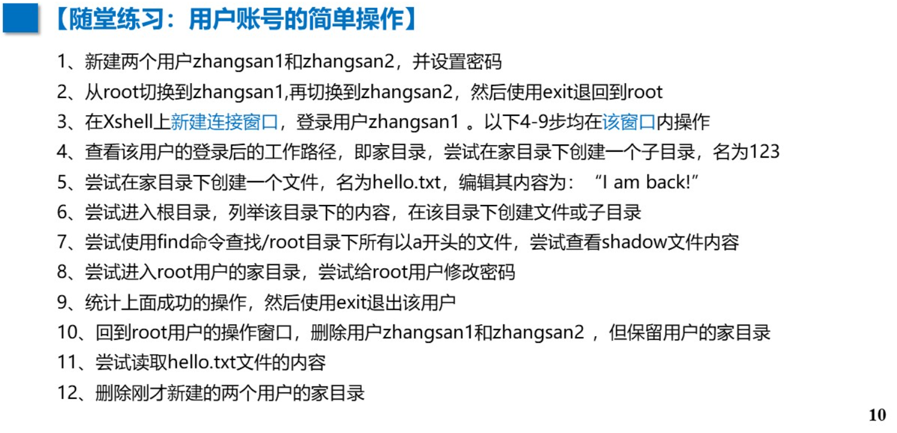

## 用户描述  (操作一个用户账号，其中会变化的文件：)

### /etc/passwd	：用户信息

```
head -3 /etc/passwd

#例
[root@localhost ~]# head -1 /etc/passwd
root:x:0:0:root:/root:/bin/bash
#root :   x   :         0          :       0         : root  :/root:/bin/bash
#用户名:密码占位:用户UID(root's UID:0):用户GID(输入root组):用户说明:家目录:shell程序

[root@localhost ~]# tail -1 /etc/passwd
zhangsan2:x:1002:1002::/home/zhangsan2:/bin/bash
用户名:	zhangsan2
密码占位:	x
用户UID:	1002
用户GID:	1002
用户说明:  :
家目录:	:/home/zhangsan2
shell程序：/bin/bash
```


### /etc/shadow	：密码信息

```
head -3 /etc/shadow

[root@localhost ~]# head -1 /etc/shadow
root:$6$VTQ.....as1::0:99999:7:::
#root : $6$VTQ.....as1 :             :        0          :       99999          :7:::
#用户名:加密后的root的密码:密码最近修改日期:密码最短有效天数(0无限):密码最长有效期(9999无限):密码失效前警告天数
```

#### 锁定/解锁/删除

##### usermod -L zhangsan2 		(锁定用户)

##### passwd -l zhangsan2 			(锁定密码)

##### usermod -U zhangsan2 		(解锁用户)

##### passwd -l zhangsan2 			(解锁密码)

```
#查看锁定状态
passwd -S zhangsan2

#删除账户密码，登录则需重设密码
passwd -d zhangsan2
```

#### 修改账号名(ID不变)

```
#格式
#usermod -l 新名 旧名

usermod -l zhangsan3 zhangsan2
```


### /home/username ：家目录

## P19 随堂练

```
#1
tail -3 /etc/shadow
tail -3 /etc/passwd
useradd KK
tail -3 /etc/shadow
tail -3 /etc/passwd

#2
tail -3 /etc/shadow
tail -3 /etc/passwd
passwd KK
123
tail -3 /etc/shadow
tail -3 /etc/passwd

#3
tail -3 /etc/shadow
tail -3 /etc/passwd
passwd -l KK
tail -3 /etc/shadow
tail -3 /etc/passwd

#4
tail -3 /etc/shadow
tail -3 /etc/passwd
passwd -S KK
tail -3 /etc/shadow
tail -3 /etc/passwd

#5
tail -3 /etc/shadow
tail -3 /etc/passwd
usermod -U KK
tail -3 /etc/shadow
tail -3 /etc/passwd

#6
tail -3 /etc/shadow
tail -3 /etc/passwd
passwd -d KK
tail -3 /etc/shadow
tail -3 /etc/passwd

#7
tail -3 /etc/shadow
tail -3 /etc/passwd
usermod -l zhangsan KK
tail -3 /etc/shadow
tail -3 /etc/passwd

#8
tail -3 /etc/shadow
tail -3 /etc/passwd
userdel -rf zhangsan
tail -3 /etc/shadow
tail -3 /etc/passwd
```

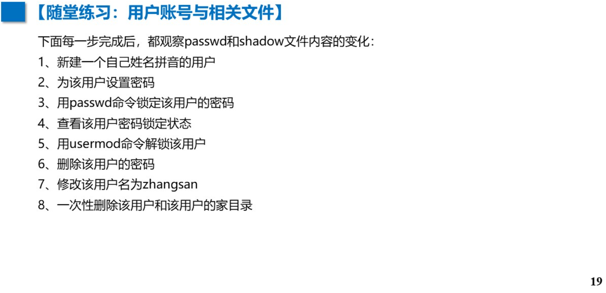


# 2	账户组的管理 => 相同属性的用户

## #用户组信息存在 /etc/grop 中

## groupadd 组名										 => 新增 用户组

```
#在新建用户时，默认生成 与用户名相同 的用户组
#格式
#groupadd 组名

groupadd JJ
tail -1 /etc/group

#JJ     :    x   :1003:
#用户组名:用户组密码:组ID
```

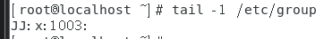


## gpasswd -a 用户名 用户组名				 => 用户组中 添加 用户

```
#用户可以在不同的用户组中
#格式
#gpasswd -a 用户名 用户组名

useradd user01
gpasswd -a user01 LL
tail -3 /etc/group
```

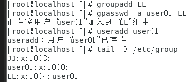


## gpasswd -d 用户名 用户组名			     => 用户组中 移除 用户

```
#只移除指定用户组中的用户
#格式
#gpasswd -d 用户名 用户组名

useradd user01
gpasswd -d user01 LL
tail -3 /etc/group
```

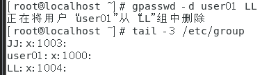


## groupdel 组名 								  => 删除 用户组

```
#不能删除创建用户时分配的组
#格式
#groupdel 用户组名

groupdel LL
tail -3 /etc/group
```

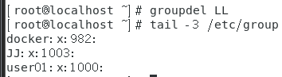


## groupmod -n 新用户组名 旧用户组名 => 修改 用户组

```
#不改变 GID
#格式
#groupmod -n 新用户组名 旧用户组名

groupmod -n OO JJ
tail -2 /etc/group
```

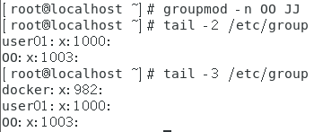


## froups 用户名										 => 查询 用户所属组

## useradd -g 用户组名 新用户名 			=> 为新建用户 指定 用户组

```
#每个用户都有一个主组和多个附加组。
#创建用户时的组:初始组，能够gpasswd-a /-d 加入/退出 的组：附加组
#格式
#useradd -g 用户组名 新用户名

useradd zhangsan01
tail -3 /etc/group

useradd -g OO zhangsan02
tail -3 /etc/group
```

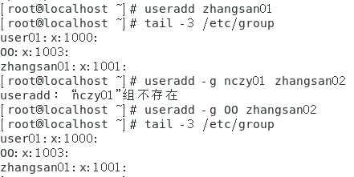


# 3	查询用户的用户组状态

## groups 用户名  =>  查询用户所属组

```
#格式
#groups 用户名

groups lp
```

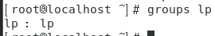


## id 用户名  		=>  查看用户

```
#格式
#id 用户名 

id root
```

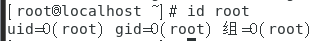


## who [操作]  	 =>  查看当前登录用户

```
#格式
#who [操作] 

who -H
```

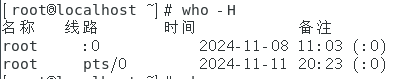


## w   				 =>  查看当前登录用户详细信息

```
#格式
#w

w
```

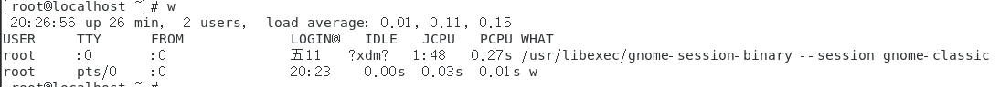


## whoami  	 =>  查看当前操作用户名

```
#格式
#whoami 

whoami
```

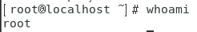


## P28 随堂练

```
#1
groupadd nanchong1
groupadd nanchong2

#2
useradd gp1
useradd gp2
useradd sq1
useradd sq2

#3
gpasswd -a gp1 nanchong1
gpasswd -a gp2 nanchong1

gpasswd -a sq1 nanchong2
gpasswd -a sq2 nanchong2

#4
groupmod -n gaoping nanchong1
groupmod -n shunqing nanchong2

#5
gpasswd -d gp1 gaoping
gpasswd -a gp1 shunqing

#6
gpasswd -a sq1 gaoping
gpasswd -a sq2 gaoping

#7
useradd jl1
gpasswd -a jl1 shunqing
useradd -g jl1 jl1

#8
groups gp1
groups gp2
groups sq1
groups sq2

#9
groupdel nanchong1
groupdel nanchong2
groupdel shunqing

userdel -r gp1
userdel -r gp2
userdel -r sq1
userdel -r sq2
```

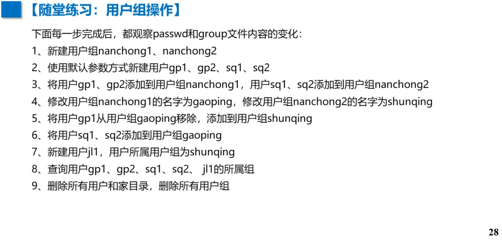

# 4	文件权限和修改

## 文件权限

```
10位属性信息
    d	  rwx  r-x  r-x . 2 root root
文件类型    1    2    3
文件类型：d 目录
1：r 读	w 写		x 执行	- 无权限
2：同用户组的其他用户的文件访问权限
3：其他组的其他用户的文件访问权限
```


## chmod 操作 对象 权限

```
#格式
#chmod 操作 对象 权限
#操作：
#+ 增加 - 减去 = 覆盖

#对象
#u 所属用户	g 同组用户	o 其他用户	a 所有用户

#例
touch modfile
ll modfile

#所有用户可执行权限x
chmod a+x modfile
ll modfile

#其他用户没有权限
chmod o= modfile
ll modfile

#禁止root写，禁止同组用户执行
chmod u-w,g-x modfile
ll modfile

#允许root执行；同组用户读、执行；其他用户读
chmod u+w,g=rx,o+r modfile
ll modfile
```

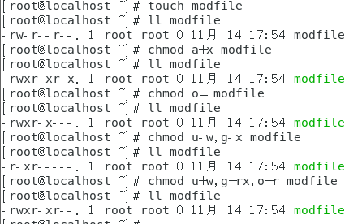


### 二进制表示

```
#有权限则1  无权限则0   4 2 1 法则
001  010  011 100  101  110  111
 1    2    3   4    5    6    7

#例
touch modfile
ll modfile

#允许所有用户所有权限
chmod 777 modfile
```

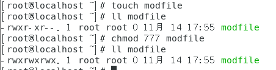

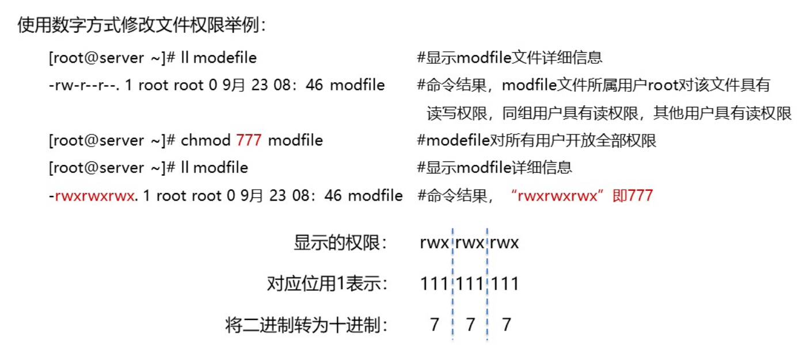

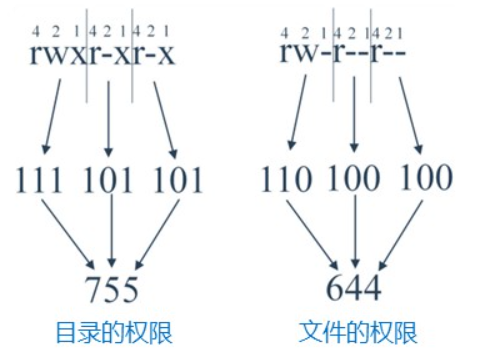


## 所属修改	chown 操作  用户:组 文件名

```
#格式
#chown 操作  用户:组 文件名

#例
#所属用户改为 user1
chown user1 chownfile

#所属用户组改为group1
chown :group1 chownfile

#所属用户改为user1，所属用户组改为group1
chown user1:group1 chownfile

#递归目录chowndir所属用户user1，所属用户组group1
chown -R user1:group1 chowndir/
```


## 文件权限操作实例

```
#分别创建3个用户  aaa   小强    旺财
useradd aaa
useradd xiaoqiang
useradd wangcai


#1 在 小强 新建xiaoqing.txt，所属用户:xiaoqiang，有rw权限
su - xiaoqiang
cd /tmp
touch xiaoqiang.txt
ls -l xiaoqiang.txt
echo "I am xiaoqiang" >> xiaoqiang.txt
```

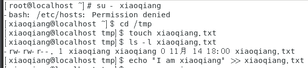


```
#2 切换到 旺财 能读不能写
exit
su - wangcai
cat /tmp/xiaoqiang.txt
echo "I am wangcai" >> /tmp/xiaoqiang.txt
```

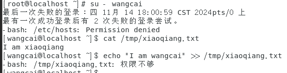

```
#3 切换到 小强 ,允许 旺财 写
exit
su - xiaoqiang
chmod o+w /tmp/xiaoqiang.txt
ls -l xiaoqiang.txt
```

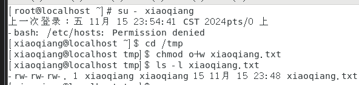


```
#4 切换到 旺财 ,对txt文件能读能写
exit
su - wangcai
ls -l /tmp/xiaoqiang.txt
echo "I am wangcai" >> /tmp/xiaoqiang.txt
cat /tmp/xiaoqiang.txt
```

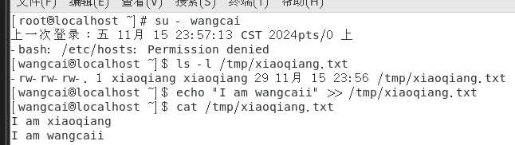


```
#5 以加入用户组方式，允许 旺财 能读写
exit
su - xiaoqiang
chmod o+w /tmp/xiaoqiang.txt
ls -l /tmp/xiaoqiang.txt

#用root给权限
exit
gpasswd -a wangcai xiaoqiang
tail -3 /etc/group
groups wangcai
```

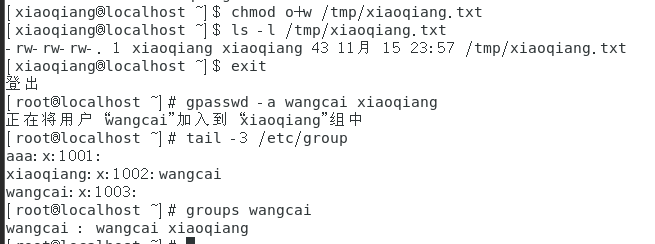


```
#用 旺财 测试是否成功
su - wangcai
groups
echo "I am wangcai，I join the xiaoqiang's group" >> /tmp/xiaoqiang.txt

#root把 旺财 移除 小强组
exit
gpasswd -d wangcai xiaoqiang
groups wangcai
```

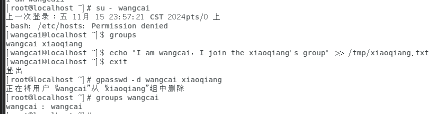


## P51 随堂练

```
#1
groupadd police
groupadd bandit

#2
useradd -g police jack
useradd -g police jerry
useradd -g bandit xh
useradd -g bandit xq


#3
sudo -u jack touch /tmp/名单.txt
chmod 640 /tmp/名单.txt
ls -l /tmp/名单.txt

#4
chmod 644 /tmp/名单.txt

#5
usermod -a -G police xh
#可读
sudo -u xh cat /tmp/名单.txt 
#可写
sudo -u xh echo "test" >> /tmp/名单.txt 

#6
userdel -r jack
userdel -r jerry
userdel -r xh
userdel -r xq
groupdel police
groupdel bandit
```

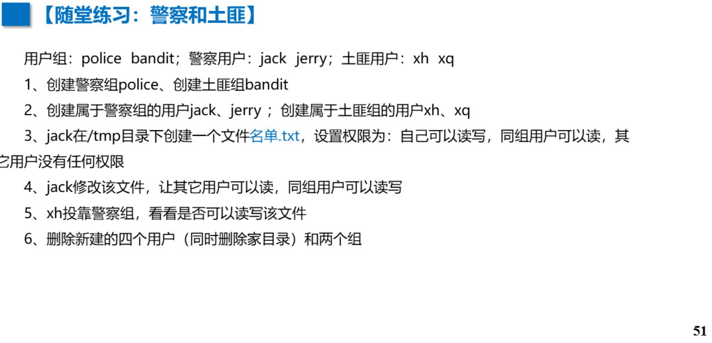


## P52 随堂练  

```
#1
groupadd sx
groupadd yg
groupadd xyj


#2
useradd ts
passwd ts
123


useradd wk
passwd wk
123


passwd bj
123

useradd ss
passwd ss
123

#3
usermod -a -G yg wk 
usermod -a -G xyj wk
usermod -a -G yg bj
usermod -a -G xyj bj

usermod -a -G sx ts
usermod -a -G xyj ts
usermod -a -G sx ss
usermod -a -G xyj ss

#4
su - wk
cd /tmp
touch hello.sh
echo "I am a monkey" >> /tmp/hello.sh
cat /tmp/hello.sh

#5
su - root
chgrp yg /tmp/hello.sh
chmod g+rw /tmp/hello.sh

#6
su - bj
echo "I am a pig" >> /tmp/hello.sh
cat /tmp/hello.sh
exit

#7
usermod -a -G yg ss 

#8
su - ss
echo "I am ss, I have become a monster" >> /tmp/hello.sh
cat /tmp/hello.sh
exit

#9
userdel -r ts
userdel -r wk
userdel -r bj
userdel -r ss

groupdel sx
groupdel yg
groupdel xyj
```

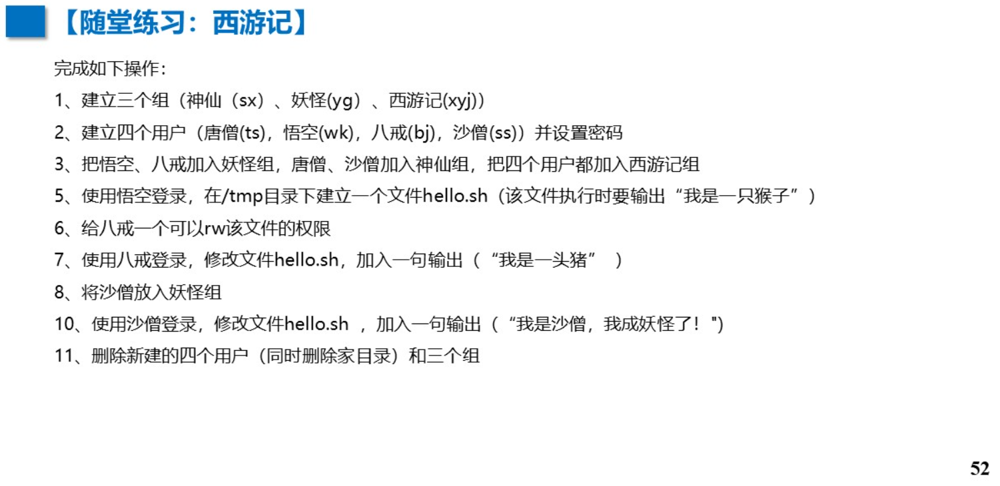


## P53 随堂练

```
#1
groupadd student
useradd stu1
usermod -a -G student stu1
passwd stu1
exit

#2
useradd stu2
passwd stu2
usermod -a -G student stu2
tail -5 /etc/passwd
tail -5 /etc/shadow
tail -5 /etc/group
gpasswd -d stu2 student

#3
tail -5 /etc/shadow
usermod -L stu1
tail -5 /etc/shadow
usermod -U stu1

#4
mkdir /right 
ls -l /right 
su - stu1

#5
chown stu1:student /right

#6
chmod 764 /right/stu1 file

#7
su - stu2
chmod u+rwx /right/stu1 file
echo "this is stu1 file modified by stu2" > /right/stu1 file
/right/stu1 file

#8 (root)
userdel -r stu1 userdel -r stu2
groupdel student
rm -rf /right
```

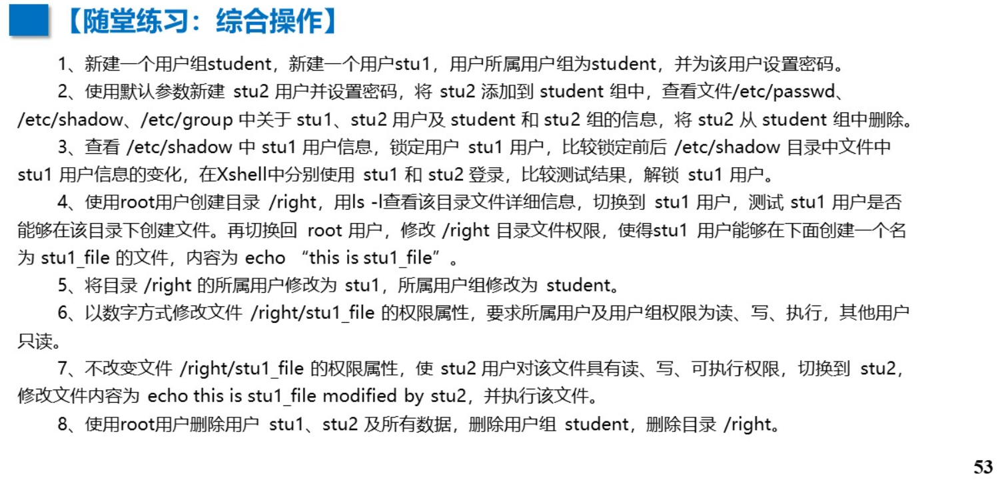
