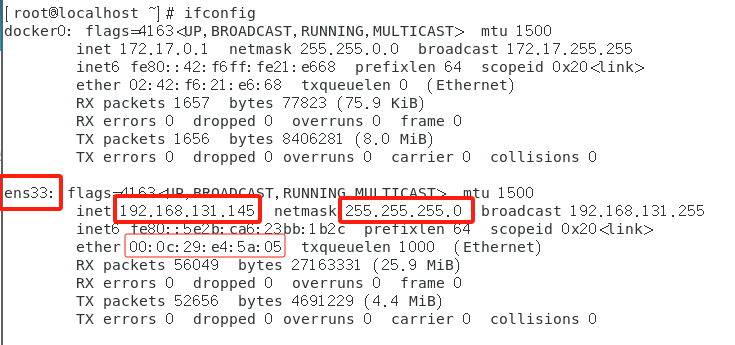
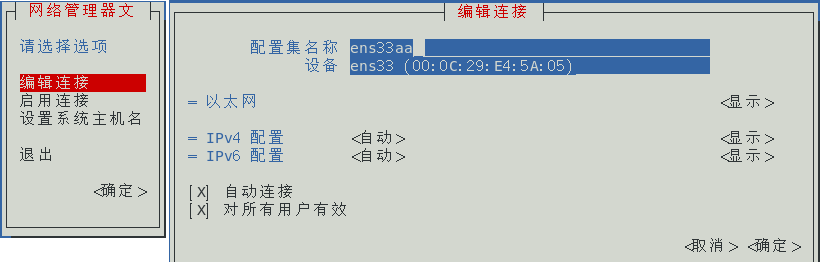
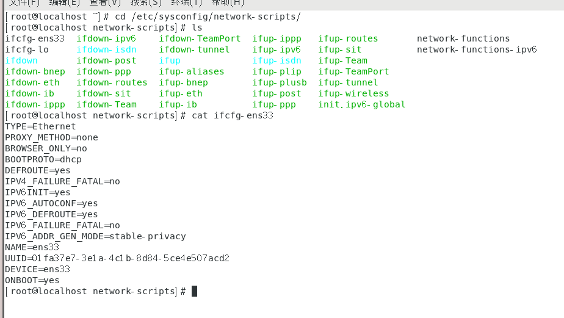
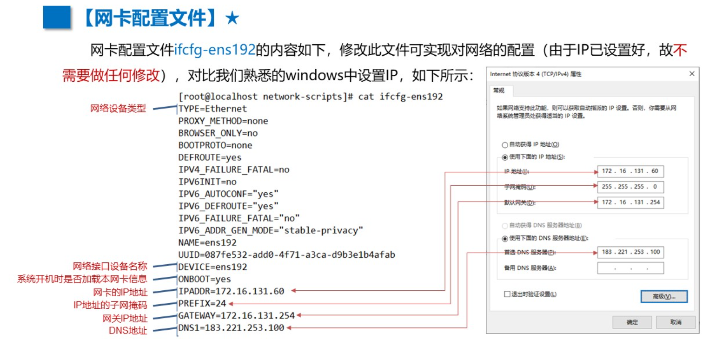
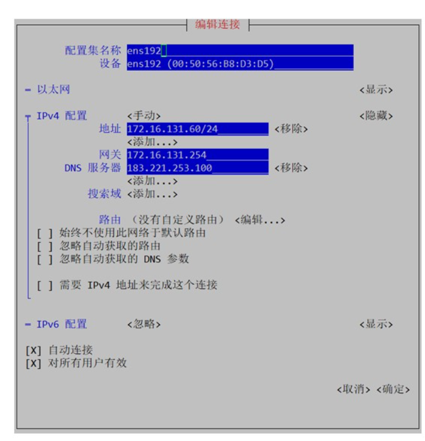
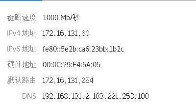
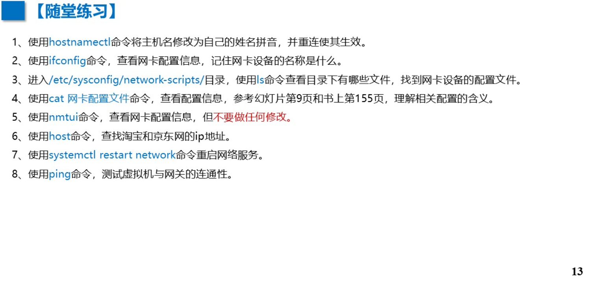
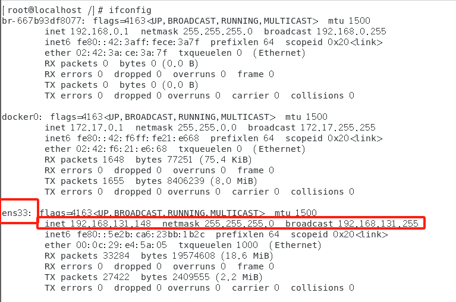
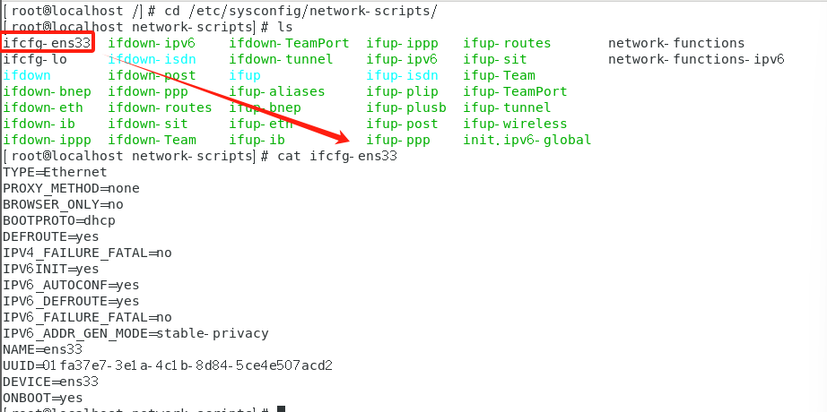
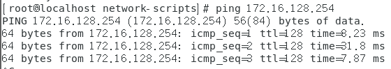

# Linux 第7章 网络配置

http://172.16.198.15:9936/z07.html

# 1 网络配置命令

## hostname 查看/修改 主机名

```
#查看
hostname

#临时改名
hostname aaa

#永久改名
hostnamectl set-hostname bbb
```


## ifconfig 显示网络设备信息

```
ifconfig

#ens33：网卡名称
#inet：IP地址
#netmask：子网掩码
#ether：MAC地址
```




## nmtui 伪图形界面修改网络配置

```
#用于修改IP地址，DNS……
nmtui
```




# 2 网络配置文件

```
#修改网络连接信息=网卡配置文件更新
#网络配置文件的目录：/etc/sysconfig/network-scripts/
#在ifconfig中已知网卡名为：ens33,则配置文件为：ifcfg-ens33

cd /etc/sysconfig/network-scripts/
ls
cat ifcfg-ens33
```






# 3 网络测试命令

## 重启网络服务命令

```
#修改网卡配置后，使配置生效
systemctl restart network
```


## 查找域名对应的IP地址

```
host www.baidu.com
```


```
#如果host不了，可能是DNS没有设置
#在Xshell中，老师给的IP是手动的，但可能DNS没有，需要在修改为183.221.253.100 ,并重启网络
#方法 一：如下图
nmutui
=>选中DNS，输入：183.221.253.100

#方法 二：  修改网络配置信息 /etc/sysconfig/network-scripts/
#设置IP地址为：172.16.131.60/24
#网关为：172.16.131.254
#DNS为：183.221.253.100

cd /etc/sysconfig/network-scripts/
ls
vim ifcfg-ens33

TYPE=Ethernet 
PROXY_METHOD=none 
BROWSER_ONLY=no 
BOOTPROTO=static 			         # 将 BOOTPROTO 从 dhcp 改为 static 
IPADDR=172.16.131.60				 # 设置 IP 地址 
PREFIX=24							 # 设置子网掩码为 /24 
GATEWAY=172.16.131.254				 # 设置网关 
DNS1=183.221.253.100				 # 设置 DNS 服务器 
DEFROUTE=yes 
IPV4_FAILURE_FATAL=no 
IPV6INIT=yes 
IPV6_AUTOCONF=yes 
IPV6_DEFROUTE=yes 
IPV6_FAILURE_FATAL=no 
IPV6_ADDR_GEN_MODE=stable-privacy 
NAME=ens33 
UUID=01fa37e7-3e1a-4c1b-8d84-5ce4e507acd2 
DEVICE=ens33 
ONBOOT=yes

ESC键=>:wq

#重启服务后，重试host
systemctl restart network
host www.baidu.com
```



## ping通网络 (网络这一节不是我的强项，请举手问老师)

```
#ping不通IP可以试试DNS
ping 172.16.194.254  

#DNS
ping  192.168.131.2
ping 183.221.253.100  
```



## 关闭防火墙服务

```
#停止 firewalld 服务并禁用,系统启动时不会自启动
systemctl stop firewalld 
systemctl disable firewalld
```


# P13 随堂练

```
#1
hostnamectl set-hostname kk

#2  (网卡名：ens__)
ifconfig

#3(ifcfg-ens__  由#2得)
cd /etc/sysconfig/network-scripts/
ls

#4
cat ifcfg-ens__

#5
nmtui
enter =>enter =>关闭网页

#6
host www.taobao.com
host www.jingdong.com

#7
systemctl restart network

#8(根据实际)
ping 172.16.128.254

```








